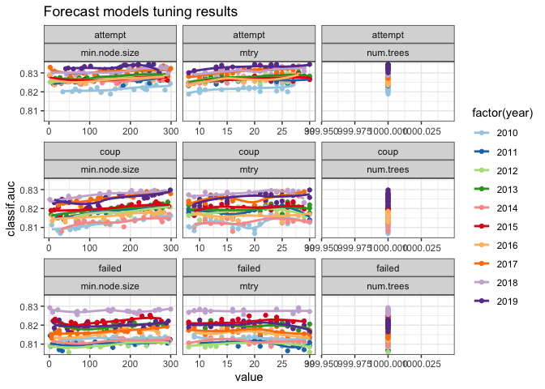
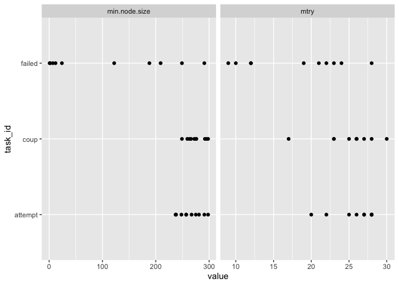
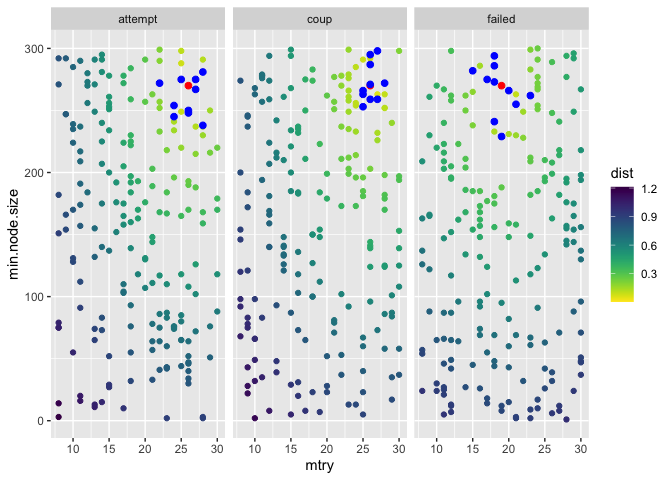
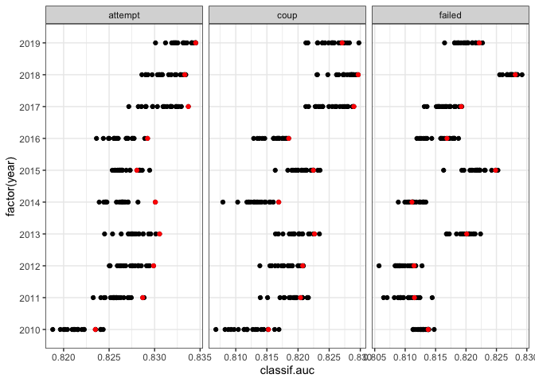

Is there a point in tuning the forecast models?
================

Compiled: 2020-05-15

Is there a point in having self-tuning models for the tests and live
forecasts, or can I just use a common set of fixed hyperparameters (HPs)
for the models for each outcome?

As it currently is, for each of the 3 outcomes and 10 years I need test
and live forecasts for, I have to run (20 tuning samples \* (8 CV folds
\* 2 CV repeats) + 1 final model) = 321 models, for a grand total of
9,630 fitted models. With fixed HPs I’d only need 30 models, which
should save A LOT of time. Right now it takes 2-3 days to run the
forecast models, even after reducing the number of columns by taking
out, e.g., "…\_imputed" variables.

A bit more on the current setup: there is a study model that is run on
the complete data for the purpose of investigating the tuning the random
foreast hyperparameter values. This uses more tuning samples, more
extensive repeated CV than the self-tuning forecast models. The results
are used to restrict the ranges of HPs that the forecast models tune
over. And then to make the actual forecasts the self-tuning forecast
models iterate over those restricted HP ranges, with less careful
resampling and HP sampling.

What I’m going to do here is analyize the tuning results for the
forecast models I ran in late April / early May, and check whether I can
just use fixed HPs without a great cost to accuracy.

This is what the raw tuning results data look like:

    ## # A tibble: 600 x 7
    ##    task_id  year iters classif.auc num.trees  mtry min.node.size
    ##    <chr>   <dbl> <dbl>       <dbl>     <dbl> <dbl>         <dbl>
    ##  1 attempt  2010    16       0.821      1000    10           285
    ##  2 attempt  2010    16       0.821      1000    14           240
    ##  3 attempt  2010    16       0.822      1000    10           235
    ##  4 attempt  2010    16       0.824      1000    21           263
    ##  5 attempt  2010    16       0.820      1000    10           128
    ##  6 attempt  2010    16       0.822      1000    25            65
    ##  7 attempt  2010    16       0.824      1000    25           298
    ##  8 attempt  2010    16       0.822      1000    19           118
    ##  9 attempt  2010    16       0.824      1000    24           241
    ## 10 attempt  2010    16       0.822      1000    18           230
    ## # … with 590 more rows

The “task\_id” column has 3 values for the 3 outcomes; “year” ranges
from 2010 to 2019. Each row’s “classif.auc” is the average AUC over the
16 (“iters”) repeated CV out-of-sample performance samples, with the
given HP values in the last 3 columns.

<!-- -->

These are all the tune samples, colored by the last year going into a
model. Rows correspon to the 3 outcomes I’m modeling, and each column is
a hyperparameter. Note that I used a fixed “num.trees” value, so these
are completely restricted based on the study model results.

A couple of impressions:

  - the range of AUC values overall is not that great, from 0.806 to
    0.835
  - most of this variation in AUC appears to be accross years, not
    accross tune samples
  - the overall trend of performance vs HP values appears to be similar
    accross years (comparing the colored lines)

What are alternative fixed values to this tuning? First, here are the
optimized vaues for each outcome-year:

<!-- -->

Failed is special. For coup and attempt, seems that high “min.node.size”
and “mtry” values are good. For failed there is more of a spread.

Let’s take something close to the mean optimum values as the fixed value
candidates.

    ## # A tibble: 6 x 4
    ## # Groups:   name [2]
    ##   name          task_id  mean median
    ##   <chr>         <chr>   <dbl>  <dbl>
    ## 1 min.node.size attempt 265.    262 
    ## 2 min.node.size coup    274.    274.
    ## 3 min.node.size failed  110.     73 
    ## 4 mtry          attempt  25.9    27 
    ## 5 mtry          coup     25.1    26 
    ## 6 mtry          failed   18      20

So say 270 accross the board for “min.node.size” (the default is 10 for
probability trees in **ranger**, so whatevs, seems bigger values work
well here), and then 19 and 26 for failed and the other outcomes,
respectively. These combinations may not actually be in the data, so
pick whatever is the closest. Since “mtry” and “min.node.size” are on
different scales, I’ll normalize by their ranges. I also want to do this
for both at the same time, not separately. Ranges:

  - mtry:
  - min.node.size:

I’m going to copy the code into the note here to make it clear what I’m
doing with these distance calculations:

``` r
fixed_hp = tibble(
  task_id = c("attempt", "coup", "failed"),
  mtry = c(26, 26, 19),
  min.node.size = c(270, 270, 270)
)

distances <- tr %>%
  select(-iters, -num.trees) %>%
  group_by(task_id, year) %>%
  mutate(
    dist_mtry = case_when(
      task_id=="failed" ~ abs(mtry - fixed_hp$mtry[fixed_hp$task_id=="failed"]),
      TRUE ~ abs(mtry - unique(fixed_hp$mtry[fixed_hp$task_id!="failed"]))
    ),
    dist_min.node.size = case_when(
      task_id=="failed" ~ abs(min.node.size - fixed_hp$min.node.size[fixed_hp$task_id=="failed"]),
      TRUE ~ abs(min.node.size - unique(fixed_hp$min.node.size[fixed_hp$task_id!="failed"]))
    )) %>%
  mutate(dist_mtry = dist_mtry / 22,
         dist_min.node.size = dist_min.node.size / 299,
         dist = sqrt(dist_mtry^2 + dist_min.node.size^2))
```

Does this make sense?:

<!-- -->

The red points are the fixed HP points I want to get close to. The blue
points are what I pick in every year. Yep, makes sense. The distances
make sense, the blue points are close to what I want (accounting for
scale differences in the x and y axes). Now I can select, for each
outcome-year sample, the closest results that I want, and them compare
how they stack up in terms of performance.

<!-- -->

Ok, this seems to work reasonably well. By definition the optimum value
is all the way on the right in each row’s cloud of points. The red
points I pick as fixed are usually pretty close. A bit less well for
failed, but oh well. The absolute AUC differences seems to be small
anyways.

However…

What if I just use the rule of thumb for “mtry”, square root of the
numbero features? There were 258 features in the last model run, so
about 16.

``` r
fixed_hp = tibble(
  task_id = c("attempt", "coup", "failed"),
  mtry = c(16, 16, 16),
  min.node.size = c(270, 270, 270)
)

distances <- tr %>%
  select(-iters, -num.trees) %>%
  group_by(task_id, year) %>%
  mutate(
    dist_mtry = case_when(
      task_id=="failed" ~ abs(mtry - fixed_hp$mtry[fixed_hp$task_id=="failed"]),
      TRUE ~ abs(mtry - unique(fixed_hp$mtry[fixed_hp$task_id!="failed"]))
    ),
    dist_min.node.size = case_when(
      task_id=="failed" ~ abs(min.node.size - fixed_hp$min.node.size[fixed_hp$task_id=="failed"]),
      TRUE ~ abs(min.node.size - unique(fixed_hp$min.node.size[fixed_hp$task_id!="failed"]))
    )) %>%
  mutate(dist_mtry = dist_mtry / 22,
         dist_min.node.size = dist_min.node.size / 299,
         dist = sqrt(dist_mtry^2 + dist_min.node.size^2))

tr %>%
  ggplot(aes(x = classif.auc, y = factor(year))) + 
  facet_wrap(~ task_id, scales = "free_x") +
  geom_point() +
  geom_point(data = heuristic, color = "red") + 
  theme_bw()
```

<!-- -->

That actually works well, too. And it’s easier, especially as I’m about
to take out unneeded feature columns.

Conclusion:

  - “mtry” fixed to `sqrt(N_features)`
  - “min.node.size” fixed to 270
