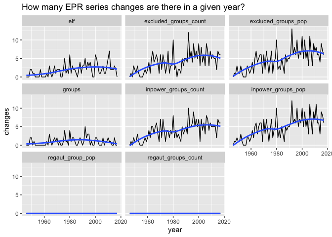
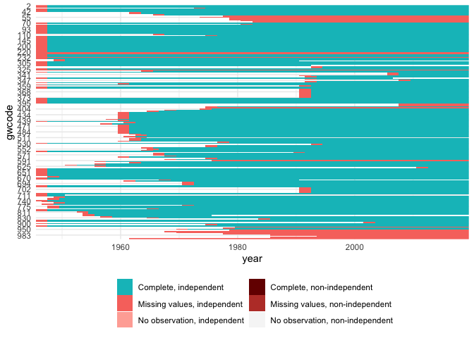

Clean EPR and make country-year version
================

  - [Functions / packages](#functions-packages)
  - [Clean raw data](#clean-raw-data)
      - [Lag data](#lag-data)
      - [Normalize to G\&W statelist](#normalize-to-gw-statelist)
  - [Handle missing values](#handle-missing-values)
  - [Variable transformations](#variable-transformations)
  - [Done, save](#done-save)

*Last updated on 20 April 2020*

## Functions / packages

``` r
library(tidyverse)
```

    ## ── Attaching packages ──────────────────────────────────────────────── tidyverse 1.2.1 ──

    ## ✓ ggplot2 3.2.1     ✓ purrr   0.3.3
    ## ✓ tibble  3.0.0     ✓ dplyr   0.8.5
    ## ✓ tidyr   1.0.2     ✓ stringr 1.4.0
    ## ✓ readr   1.3.1     ✓ forcats 0.5.0

    ## Warning: package 'tibble' was built under R version 3.6.2

    ## ── Conflicts ─────────────────────────────────────────────────── tidyverse_conflicts() ──
    ## x dplyr::filter() masks stats::filter()
    ## x dplyr::lag()    masks stats::lag()

``` r
library(states)
```

    ## 
    ## Attaching package: 'states'

    ## The following object is masked from 'package:readr':
    ## 
    ##     parse_date

``` r
library(readr)
```

## Clean raw data

``` r
raw <- read_csv("input/EPR-2019.csv",
                col_types = cols(
                  gwid = col_integer(),
                  statename = col_character(),
                  from = col_integer(),
                  to = col_integer(),
                  group = col_character(),
                  groupid = col_double(),
                  gwgroupid = col_double(),
                  umbrella = col_integer(),
                  size = col_double(),
                  status = col_character(),
                  reg_aut = col_logical()
                ))

raw <- raw %>%
    rename(gwcode = gwid) %>%
    mutate(reg_aut = case_when(
      is.na(reg_aut) ~ FALSE,
      TRUE ~ reg_aut
    ))
  raw
```

    ## # A tibble: 4,255 x 11
    ##    gwcode statename  from    to group groupid gwgroupid umbrella   size status
    ##     <int> <chr>     <int> <int> <chr>   <dbl>     <dbl>    <int>  <dbl> <chr> 
    ##  1      2 United S…  1946  1965 Whit…    1000    201000       NA 0.691  MONOP…
    ##  2      2 United S…  1946  1965 Lati…    2000    202000       NA 0.125  IRREL…
    ##  3      2 United S…  1946  1965 Afri…    3000    203000       NA 0.124  DISCR…
    ##  4      2 United S…  1946  1965 Asia…    4000    204000       NA 0.036  IRREL…
    ##  5      2 United S…  1946  1965 Amer…    5000    205000       NA 0.0078 POWER…
    ##  6      2 United S…  1946  1965 Arab…    6000    206000       NA 0.0042 IRREL…
    ##  7      2 United S…  1966  2008 Whit…    1000    201000       NA 0.691  DOMIN…
    ##  8      2 United S…  1966  2008 Lati…    2000    202000       NA 0.125  POWER…
    ##  9      2 United S…  1966  2008 Afri…    3000    203000       NA 0.124  POWER…
    ## 10      2 United S…  1966  2008 Asia…    4000    204000       NA 0.036  POWER…
    ## # … with 4,245 more rows, and 1 more variable: reg_aut <lgl>

``` r
# convert to country-year
epr <- raw %>%
  dplyr::mutate(year = min(raw$from)) %>%
  tidyr::complete(year = seq(min(from), max(to)),
                  nesting(gwcode, from, to, group, groupid, size, status, reg_aut)) %>%
  dplyr::filter(year >= from & year <= to)

# not clear about irrelevant and state collapse
excl_val <- c("POWERLESS", "DISCRIMINATED", "SELF-EXCLUSION")
incl_val <- c("MONOPOLY", "DOMINANT", "JUNIOR PARTNER", "SENIOR PARTNER",
              "IRRELEVANT", "STATE COLLAPSE")

epr <- epr %>%
  group_by(gwcode, year) %>%
  dplyr::summarize(
    groups = n(),
    elf    = sum(size^2),
    excluded_groups_count = sum(status %in% excl_val),
    excluded_groups_pop   = sum(subset(size, status %in% excl_val)),
    inpower_groups_count  = sum(status %in% incl_val),
    inpower_groups_pop    = sum(subset(size, status %in% incl_val)),
    regaut_groups_count   = sum(reg_aut=="true"),
    regaut_group_pop      = sum(subset(size, reg_aut=="true"))
  )
```

### Lag data

``` r
# This version of EPR ranges only to 2017. Should we lag or carry-forward impute?
# UPDATE: check how this has changed and whether lagging strategy still makes sense

# How often do the EPR data shift?
df <- epr %>%
  # convert to long format
  pivot_longer(-c(gwcode, year)) %>%
  group_by(gwcode, name) %>%
  arrange(gwcode, name, year) %>%
  mutate(shift = c(FALSE, tail(value!=lag(value), -1)))
# df is long with columns [gwcode, year, name, value, shift]
# change it so that we see, for each variable (name), how many shifts there are 
# per year
df <- df %>%
  group_by(name, year) %>%
  summarize(changes = sum(shift)) 

ggplot(df, aes(x = year, y = changes, group = name)) +
  facet_wrap(~ name) + 
  geom_line() +
  labs(title = "How many EPR series changes are there in a given year?") +
  geom_smooth(se = FALSE)
```

    ## `geom_smooth()` using method = 'loess' and formula 'y ~ x'

<!-- -->

``` r
# Ok, for the most recent years there are 5-10 changes per year for some indicators. So it is dangerous to carry-forward and assume the same power structure has been in place. Lag and carry-back impute initial years instead. 

# UPDATE: check the lag amount
epr <- epr %>% 
  mutate(year = year + 2)
```

### Normalize to G\&W statelist

The following cases are not present in the country-year EPR data:

``` r
# UPDATE:
# the raw EPR data start in 1946, so use that year
# end year should be the year we need data up to
master <- state_panel(1946, 2019, by = "year", partial = "any")

epr <- left_join(master, epr, by = c("gwcode", "year"))
```

## Handle missing values

``` r
# UPDATE: if the lag changed this will need to change

# Due to the lagging the first 2-years of values are missing. Take the actual
# observed first-year value for these.
plot_missing(epr)
```

<!-- -->

``` r
# Carry-back impute
epr <- epr %>% 
  group_by(gwcode) %>%
  arrange(gwcode, year) %>%
  fill(-c(gwcode, year), .direction = "up")

# Are any countries completely missing?
missing_country <- epr %>%
  group_by(gwcode) %>%
  # track original number of years for gwcode
  mutate(n = n()) %>%
  ungroup() %>%
  # filter out so we only keep rows with missing values for ALL non-ID cols
  filter(!complete.cases(.)) %>%
  group_by(gwcode, n) %>%
  summarize(missing = n()) %>%
  mutate(country = country_names(gwcode, shorten = TRUE)) %>%
  filter(n==missing) %>%
  select(gwcode, country, n)
write_csv(missing_country, "output/missing-all-country.csv")
missing_country %>%
  knitr::kable()
```

| gwcode | country               |  n |
| -----: | :-------------------- | -: |
|     54 | Dominica              | 42 |
|     55 | Grenada               | 46 |
|     56 | Saint Lucia           | 41 |
|     57 | Saint Vincent         | 41 |
|     58 | Antigua & Barbuda     | 39 |
|     60 | Saint Kitts and Nevis | 37 |
|    221 | Monaco                | 74 |
|    223 | Liechtenstein         | 74 |
|    232 | Andorra               | 74 |
|    331 | San Marino            | 74 |
|    396 | Abkhazia              | 12 |
|    397 | South Ossetia         | 12 |
|    403 | Sao Tome and Principe | 45 |
|    511 | Zanzibar              |  2 |
|    591 | Seychelles            | 44 |
|    935 | Vanuatu               | 40 |
|    970 | Kiribati              | 41 |
|    971 | Nauru                 | 52 |
|    972 | Tonga                 | 50 |
|    973 | Tuvalu                | 42 |
|    983 | Marshall Islands      | 34 |
|    986 | Palau                 | 26 |
|    987 | Micronesia            | 34 |
|    990 | Samoa/Western Samoa   | 58 |

``` r
# All are microstates, so this is ok. Take them out

# Take out countries that are missing all values
epr <- epr %>%
  dplyr::filter(!gwcode %in% missing_country[["gwcode"]])

# There should be no missing values left
sapply(epr, function(x) sum(is.na(x))) %>%
  enframe(name = "Variable", value = "N_missing")
```

    ## # A tibble: 10 x 2
    ##    Variable              N_missing
    ##    <chr>                     <int>
    ##  1 gwcode                        0
    ##  2 year                          0
    ##  3 groups                        0
    ##  4 elf                           0
    ##  5 excluded_groups_count         0
    ##  6 excluded_groups_pop           0
    ##  7 inpower_groups_count          0
    ##  8 inpower_groups_pop            0
    ##  9 regaut_groups_count           0
    ## 10 regaut_group_pop              0

## Variable transformations

``` r
# Identify whether a shift in the in-/out- groups has happened
epr <- epr %>%
  group_by(gwcode) %>%
  arrange(gwcode, year) %>%
  mutate(
    excluded_groups_shift = as.integer(
      c(0, tail(excluded_groups_count!=lag(excluded_groups_count), -1))),
    inpower_groups_shift = as.integer(
      c(0, tail(inpower_groups_count!=lag(inpower_groups_count), -1)))
    ) 

# Sometimes an inpower/excluded shift occurs without a change in the other
# So keep both excluded groupd and inpower groups shift indicators seperate
table(epr$excluded_groups_shift, epr$inpower_groups_shift)
```

    ##    
    ##         0     1
    ##   0 10184    17
    ##   1    29   258

``` r
# Add year-to-year diff versions
epr <- epr %>%
  group_by(gwcode) %>%
  arrange(gwcode, year) %>%
  mutate(
    excluded_groups_count_diff = c(0, diff(excluded_groups_count)),
    excluded_groups_pop_diff   = c(0, diff(excluded_groups_pop)),
    inpower_groups_count_diff  = c(0, diff(inpower_groups_count)),
    inpower_groups_pop_diff    = c(0, diff(inpower_groups_pop))
  )
```

## Done, save

``` r
write_csv(epr, "output/epr.csv")
```
