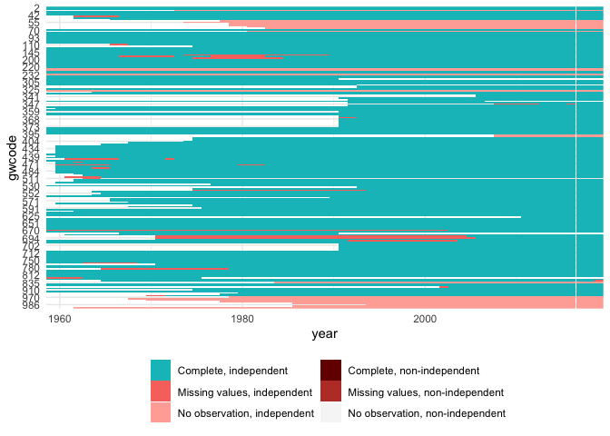

V-Dem
================

  - [Clean raw data](#clean-raw-data)
      - [Normalize to G\&W statelist](#normalize-to-gw-statelist)
  - [Handle missing values](#handle-missing-values)
  - [Add variable transformations](#add-variable-transformations)
  - [Done, save](#done-save)

*Last updated on 17 April 2020*

This script:

  - 
## Clean raw data

``` r
library(readr)
library(states)
```

    ## 
    ## Attaching package: 'states'

    ## The following object is masked from 'package:readr':
    ## 
    ##     parse_date

``` r
library(dplyr)
```

    ## 
    ## Attaching package: 'dplyr'

    ## The following objects are masked from 'package:stats':
    ## 
    ##     filter, lag

    ## The following objects are masked from 'package:base':
    ## 
    ##     intersect, setdiff, setequal, union

``` r
raw = read_csv("input/v10/V-Dem-CY-Core-v10.csv")
```

    ## Parsed with column specification:
    ## cols(
    ##   .default = col_double(),
    ##   country_name = col_character(),
    ##   country_text_id = col_character(),
    ##   historical_date = col_date(format = ""),
    ##   histname = col_character(),
    ##   gapstart1 = col_logical(),
    ##   gapstart2 = col_logical(),
    ##   gapstart3 = col_logical(),
    ##   gapend1 = col_logical(),
    ##   gapend2 = col_logical(),
    ##   gapend3 = col_logical()
    ## )

    ## See spec(...) for full column specifications.

    ## Warning: 8330 parsing failures.
    ##  row       col           expected actual                              file
    ## 2075 gapstart1 1/0/T/F/TRUE/FALSE   1851 'input/v10/V-Dem-CY-Core-v10.csv'
    ## 2075 gapend1   1/0/T/F/TRUE/FALSE   1917 'input/v10/V-Dem-CY-Core-v10.csv'
    ## 2076 gapstart1 1/0/T/F/TRUE/FALSE   1851 'input/v10/V-Dem-CY-Core-v10.csv'
    ## 2076 gapend1   1/0/T/F/TRUE/FALSE   1917 'input/v10/V-Dem-CY-Core-v10.csv'
    ## 2077 gapstart1 1/0/T/F/TRUE/FALSE   1851 'input/v10/V-Dem-CY-Core-v10.csv'
    ## .... ......... .................. ...... .................................
    ## See problems(...) for more details.

``` r
v2x = raw %>%
  # Most v-dem incies starts with v2x, but some have the form v2x[a-z]{2}
  # Thus uses machtes() rather than starts_with()
  select(country_name, COWcode, year, matches("^v2x[a-z]{0,2}\\_", perl = TRUE)) %>%
  # We don't need to credible intervals, sd, etc.
  select(-ends_with("codehigh"), -ends_with("codelow"), -ends_with("sd"),
         -ends_with("osp")) %>%
  # take out the discrete regime variable, it will get treated as integer
  # and i don't want to deal with dummying it out
  select(-starts_with("v2x_regime")) %>%
  # Variables with lots of missing values
  # UPDATE: run this first with them and see below whether they still have 
  # missing value issues
  # academic freedom index 
  select(-v2xca_academ) %>%
  # legislative control of the executive
  select(-v2xlg_legcon) %>%
  # party institutionalization
  select(-v2xps_party) %>%
  # local government index
  select(-v2xel_locelec) %>%
  # political exclusion
  select(-contains("v2xpe")) %>%  # completely missing for some countries
  # direct democracy
  select(-contains("v2xdd")) %>%  # completely missing for some countries
  # 2020-04-17: imputing all these indices is going to be a nightmare;
  # for now revert back to only v2x_ versions
  select(country_name, COWcode, year, starts_with("v2x_")) %>%
  # G&W doesn't start until 1816, so take out earlier
  filter(year > 1815)
```

### Normalize to G\&W statelist

I’m only concerned about getting data for 1960 on. Further below I’m
adding a year to year diff, so make it 1959 to avoid missing first year
values for those transformations.

``` r
# Serbia/Yugoslavia change in 2006
# Change 345 to 340 from 2006 on, below. But then we also need to add a row for 3
# 45 in 2006, with same values. Extract this now.
yugo2006 <- v2x %>% filter(year==2006 & COWcode==345) %>%
  rename(gwcode = COWcode)

# Change from COW codes to G&W codes
v2xgw = v2x %>%
  rename(gwcode = COWcode) %>%
  mutate(gwcode = case_when(
    gwcode == 255 ~ 260,
    gwcode == 679 ~ 678,
    gwcode == 345 & year >= 2006 ~ 340,
    TRUE ~ gwcode))

# add Yugo 2006 back in
v2xgw <- bind_rows(v2xgw, yugo2006) %>%
  arrange(gwcode, country_name, year)

# Keep only post-1959 data
v2xgw <- filter(v2xgw, year >= 1959)

# Some non-state entities are missing GW codes, drop them
v2xgw %>% 
  filter(is.na(gwcode)) %>%
  group_by(country_name) %>%
  summarize(years = paste0(range(year), collapse = " - "))
```

    ## # A tibble: 4 x 2
    ##   country_name        years      
    ##   <chr>               <chr>      
    ## 1 Hong Kong           1959 - 2019
    ## 2 Palestine/Gaza      1959 - 2019
    ## 3 Palestine/West Bank 1967 - 2019
    ## 4 Somaliland          1959 - 2019

``` r
v2xgw <- filter(v2xgw, !is.na(gwcode))

# Check case-list inconsistencies; this can be helpful for ID'ing country code
# mismatches
# UPDATE: check both instances of "check" below manually
statelist <- state_panel(1959, max(v2xgw$year), partial = "any")
sets <- states::compare(v2xgw, statelist)

data(gwstates)
gwstates <- gwstates %>%
  select(gwcode, country_name, start, end) %>%
  # some states have more than one spell; only check last
  group_by(gwcode) %>%
  slice(n())

# Cases in v2xgw but not in statelist; these could be miscoded GW codes
check <- sets %>% 
  filter(case_in_df1, !case_in_df2) %>%
  left_join(gwstates, by = "gwcode") %>%
  group_by(gwcode) %>%
  summarize(years = paste0(range(year), collapse = " - "),
            start = unique(start), end = unique(end))

# Cases in statelist but not in v2xgw
check <- sets %>% 
  filter(case_in_df2, !case_in_df1) %>%
  left_join(gwstates, by = "gwcode") %>%
  group_by(gwcode) %>%
  summarize(years = paste0(range(year), collapse = " - "),
            country_name = unique(country_name),
            start = unique(start), end = unique(end))

# Add in missing cases from G&W state list and drop excess country-years not 
# in G&W list (left join)
v2xgw <- left_join(statelist, v2xgw, by = c("gwcode", "year")) %>%
  arrange(gwcode, year)
```

## Handle missing values

``` r
# Switch names again to make it shorter; doing it here allows me to re-run the
# chunk above if something goes wrong here during interactive checking
v2x <- v2xgw

# Are any countries completely missing?
missing_country <- v2x %>%
  group_by(gwcode) %>%
  # track original number of years for gwcode
  mutate(n = n()) %>%
  # filter out so we only keep rows with missing values for ALL non-ID cols
  filter_at(vars(starts_with("v2x")), all_vars(is.na(.))) %>%
  group_by(gwcode, n) %>%
  summarize(missing = n()) %>%
  mutate(country = country_names(gwcode, shorten = TRUE)) %>%
  filter(n==missing) %>%
  select(gwcode, country, n)

write_csv(missing_country, "output/missing-all-country.csv")
missing_country %>%
  knitr::kable()
```

| gwcode | country               |  n |
| -----: | :-------------------- | -: |
|     31 | Bahamas               | 47 |
|     54 | Dominica              | 42 |
|     55 | Grenada               | 46 |
|     56 | Saint Lucia           | 41 |
|     57 | Saint Vincent         | 41 |
|     58 | Antigua & Barbuda     | 39 |
|     60 | Saint Kitts and Nevis | 37 |
|     80 | Belize                | 39 |
|    221 | Monaco                | 61 |
|    223 | Liechtenstein         | 61 |
|    232 | Andorra               | 61 |
|    331 | San Marino            | 61 |
|    396 | Abkhazia              | 12 |
|    397 | South Ossetia         | 12 |
|    835 | Brunei                | 36 |
|    970 | Kiribati              | 41 |
|    971 | Nauru                 | 52 |
|    972 | Tonga                 | 50 |
|    973 | Tuvalu                | 42 |
|    983 | Marshall Islands      | 34 |
|    986 | Palau                 | 26 |
|    987 | Micronesia            | 34 |
|    990 | Samoa/Western Samoa   | 58 |

``` r
# Take out countries missing all values
v2x <- v2x %>% 
  dplyr::filter(!gwcode %in% missing_country[["gwcode"]])

# Cameroon is missing first year values; take 2nd year values
drop_in <- v2x %>% filter(gwcode==471 & year==1961) %>% mutate(year = 1960)
v2x[v2x$gwcode==471 & v2x$year==1960, ] <- drop_in

# Now check whether any particular variable is missing completely for a year
# I'm not ok imputing in such an instance, so in that case the variable should
# be taken out.
check <- v2x %>% 
  group_by(gwcode) %>% 
  mutate(n = n(), year = NULL) %>% 
  group_by(gwcode, n, country_name) %>% 
  # for each column we will now have # of missing vals
  summarize_all(~sum(is.na(.))) %>%
  # only check ones with at least 1 missing value
  filter_at(vars(starts_with("v2x")), any_vars(. > 0))

# How many missing values are there for each variable?
sapply(v2x, function(x) sum(is.na(x))) %>%
  tibble::enframe(name = "variable", value = "missing") %>%
  arrange(desc(missing)) %>%
  knitr::kable()
```

| variable            | missing |
| :------------------ | ------: |
| v2x\_gender         |     158 |
| v2x\_genpp          |     158 |
| v2x\_libdem         |      52 |
| v2x\_divparctrl     |      38 |
| v2x\_corr           |      34 |
| v2x\_liberal        |      33 |
| v2x\_jucon          |      31 |
| v2x\_polyarchy      |      19 |
| v2x\_partipdem      |      19 |
| v2x\_delibdem       |      19 |
| v2x\_egaldem        |      19 |
| v2x\_api            |      19 |
| v2x\_mpi            |      19 |
| v2x\_EDcomp\_thick  |      19 |
| v2x\_neopat         |       1 |
| v2x\_feduni         |       1 |
| gwcode              |       0 |
| year                |       0 |
| country\_name       |       0 |
| v2x\_freexp\_altinf |       0 |
| v2x\_frassoc\_thick |       0 |
| v2x\_suffr          |       0 |
| v2x\_elecoff        |       0 |
| v2x\_partip         |       0 |
| v2x\_cspart         |       0 |
| v2x\_egal           |       0 |
| v2x\_accountability |       0 |
| v2x\_veracc         |       0 |
| v2x\_diagacc        |       0 |
| v2x\_horacc         |       0 |
| v2x\_ex\_confidence |       0 |
| v2x\_ex\_direlect   |       0 |
| v2x\_ex\_hereditary |       0 |
| v2x\_ex\_military   |       0 |
| v2x\_ex\_party      |       0 |
| v2x\_civlib         |       0 |
| v2x\_clphy          |       0 |
| v2x\_clpol          |       0 |
| v2x\_clpriv         |       0 |
| v2x\_execorr        |       0 |
| v2x\_pubcorr        |       0 |
| v2x\_gencl          |       0 |
| v2x\_gencs          |       0 |
| v2x\_rule           |       0 |
| v2x\_elecreg        |       0 |
| v2x\_freexp         |       0 |
| v2x\_hosabort       |       0 |
| v2x\_hosinter       |       0 |
| v2x\_legabort       |       0 |

``` r
foo <- v2x
foo$country_name <- NULL
plot_missing(foo)
```

<!-- -->

## Add variable transformations

``` r
#
#   Add variable transformations ----
#   ___________________________ 

# first we need to identify country-spells, to make sure gaps don't accidentally
# cross over into what are supposed to be year to year changes
v2x = v2x %>%
  group_by(country_name) %>%
  arrange(year) %>%
  mutate(spell_id = id_date_sequence(year))

v2x_feats = v2x %>%
  group_by(country_name) %>%
  mutate_at(vars(starts_with("v2x_")), list(diff = ~c(0, diff(.))))
```

## Done, save

``` r
write_csv(v2x, "output/v-dem.csv")
```
