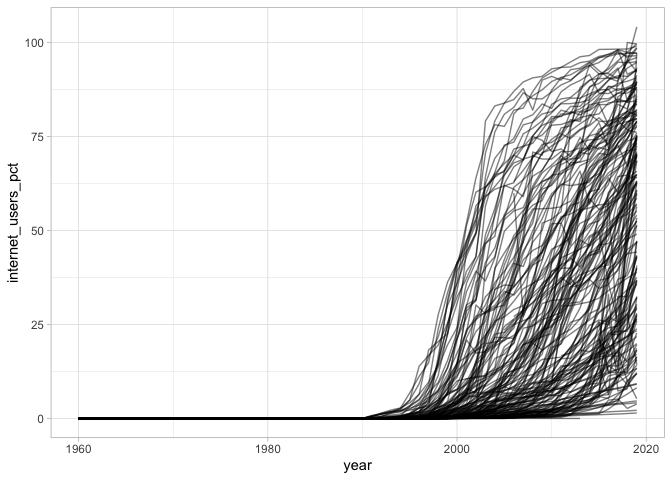
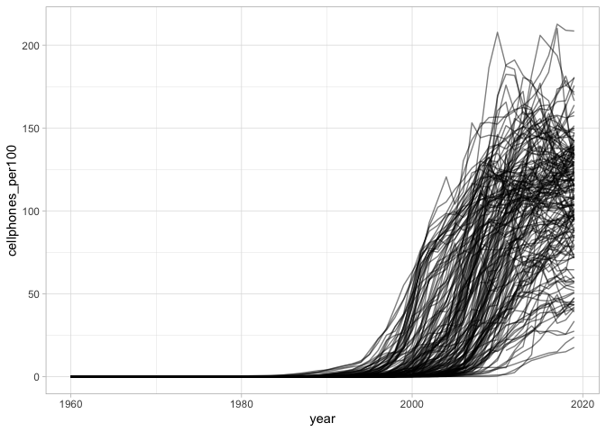

WDI: ICT
================

*Last updated on: 2020-04-24*

Cellphone and internet adoptions rates for all countries, 1960 on.

  - The WDI indicators used for this are IT.CEL.SETS.P2 and
    IT.NET.USER.ZS.
  - The data were changed to conform as much as possible to the
    Gleditsch & Ward state list.
  - The data are lagged 1 year so that there are 2019 values
  - All missing values for series that were not completely missing for a
    country have been imputed. The strategy was:
      - Set all values before the year with the first non-0 values to 0.
        This was 1980 for cell phones and 1990 for internet users.
      - If there was a gap with 0 on the left and \<1 on the right, set
        the gap NA’s to 0.
      - For any other gaps with less than 10 NA’s and observed values
        both left and right, linear impute.
      - Impute final year missing values using the average growth rate
        over the previous 5 years when possible
      - The remaining more problematic cases are imputed using a
        combination of linear imputation or logistic growth curve
        estimates.

The general idea with this complex imputation approach was to end up
with imputed values that are defensible when someone looks at the series
for a country. This is not always the case with more automatic
imputation methods.

``` r
library(ggplot2)
library(dplyr)
```

    ## 
    ## Attaching package: 'dplyr'

    ## The following objects are masked from 'package:stats':
    ## 
    ##     filter, lag

    ## The following objects are masked from 'package:base':
    ## 
    ##     intersect, setdiff, setequal, union

``` r
df <- read.csv("output/wdi-ict.csv")

glimpse(df)
```

    ## Rows: 9,321
    ## Columns: 6
    ## $ gwcode                     <int> 2, 2, 2, 2, 2, 2, 2, 2, 2, 2, 2, 2, 2, 2, …
    ## $ year                       <int> 1960, 1961, 1962, 1963, 1964, 1965, 1966, …
    ## $ cellphones_per100          <dbl> 0.00000000, 0.00000000, 0.00000000, 0.0000…
    ## $ internet_users_pct         <dbl> 0, 0, 0, 0, 0, 0, 0, 0, 0, 0, 0, 0, 0, 0, …
    ## $ cellphones_per100_imputed  <int> 1, 0, 1, 1, 1, 1, 0, 1, 1, 1, 1, 0, 1, 1, …
    ## $ internet_users_pct_imputed <int> 1, 1, 1, 1, 1, 1, 1, 1, 1, 1, 1, 1, 1, 1, …

``` r
ggplot(df, aes(x = year, y = internet_users_pct, group = gwcode)) +
  geom_line(alpha = 0.5) +
  theme_light()
```

<!-- -->

``` r
# Scaled version that is adjusted for annual mean and sd
ggplot(df, aes(x = year, y = cellphones_per100, group = gwcode)) +
  geom_line(alpha = 0.5) +
  theme_light()
```

<!-- -->

## Data cleaning

See [clean-data.md](clean-data.md) for results of the data cleaning
script.
