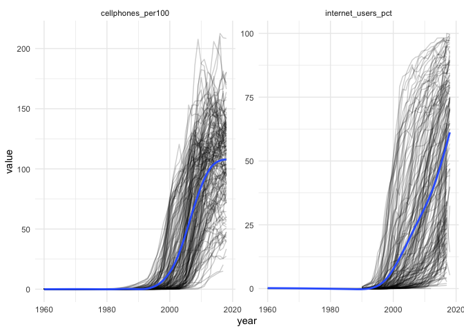
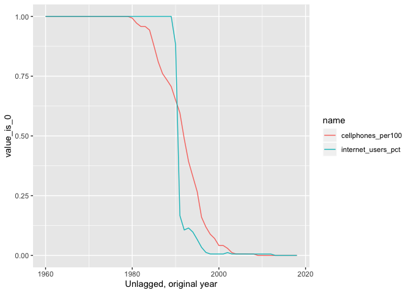
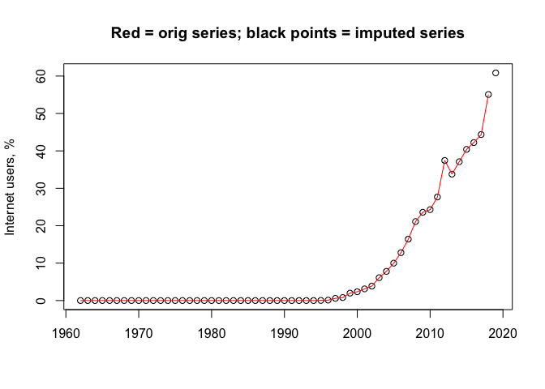
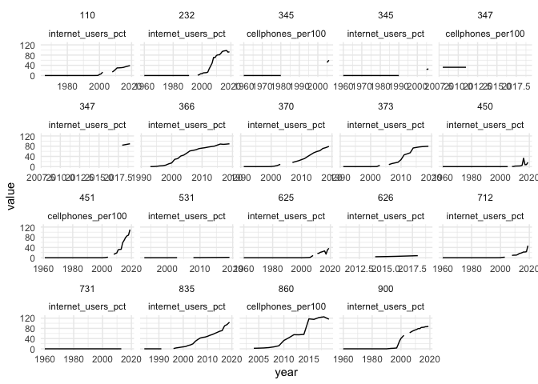

Ingest WDI ICT (Internet and mobile use)
================

  - [Packages / functions](#packages-functions)
  - [Explore possible indicators](#explore-possible-indicators)
  - [Get raw data](#get-raw-data)
  - [Clean raw data](#clean-raw-data)
      - [Lag data](#lag-data)
      - [Normalize to G\&W statelist](#normalize-to-gw-statelist)
  - [Handle missing values](#handle-missing-values)
      - [Identify types of NA
        sequences](#identify-types-of-na-sequences)
      - [Impute 0 - \<1 and short gaps](#impute-0---1-and-short-gaps)
      - [Impute missing final year
        values](#impute-missing-final-year-values)
      - [Impute problem cases](#impute-problem-cases)
      - [Impute internet users](#impute-internet-users)
  - [Imputation](#imputation)
      - [Impute internet users](#impute-internet-users-1)
  - [PICK UP HERE AGAIN](#pick-up-here-again)
      - [Spot check imputed series](#spot-check-imputed-series)
      - [Mark imputed values](#mark-imputed-values)
  - [Done, save](#done-save)

*Last updated on 23 April 2020*

## Packages / functions

``` r
library("WDI")
library("dplyr")
```

    ## 
    ## Attaching package: 'dplyr'

    ## The following objects are masked from 'package:stats':
    ## 
    ##     filter, lag

    ## The following objects are masked from 'package:base':
    ## 
    ##     intersect, setdiff, setequal, union

``` r
library("ggplot2")
library("lubridate")
```

    ## 
    ## Attaching package: 'lubridate'

    ## The following objects are masked from 'package:dplyr':
    ## 
    ##     intersect, setdiff, union

    ## The following objects are masked from 'package:base':
    ## 
    ##     date, intersect, setdiff, union

``` r
library("nlme")  # model cell phone growth curves
```

    ## 
    ## Attaching package: 'nlme'

    ## The following object is masked from 'package:dplyr':
    ## 
    ##     collapse

``` r
library("zoo")
```

    ## 
    ## Attaching package: 'zoo'

    ## The following objects are masked from 'package:base':
    ## 
    ##     as.Date, as.Date.numeric

``` r
library("forecast")
```

    ## Registered S3 method overwritten by 'xts':
    ##   method     from
    ##   as.zoo.xts zoo

    ## Registered S3 method overwritten by 'quantmod':
    ##   method            from
    ##   as.zoo.data.frame zoo

    ## Registered S3 methods overwritten by 'forecast':
    ##   method             from    
    ##   fitted.fracdiff    fracdiff
    ##   residuals.fracdiff fracdiff

    ## 
    ## Attaching package: 'forecast'

    ## The following object is masked from 'package:nlme':
    ## 
    ##     getResponse

``` r
library("broom")
library("states")
library("readr")
```

    ## 
    ## Attaching package: 'readr'

    ## The following object is masked from 'package:states':
    ## 
    ##     parse_date

``` r
library("stringr")
library("tidyr")
library(purrr)

# Convert a WDI data frame to G&W statelist
# This will add a gwcode column. It also adds a row for Yugo/Serbia 2006,
# which is why this cannot be a function that creates a G&W column in the 
# existing data frame.
# @param x a data frame genereated by WDI::WDI()
# @returns a data frame like x, but with a gwcode column and extra row
wdi_to_gw <- function(x, iso2c = "iso2c", country = "country", year = "year") {
  
  # In case the ID columns don't match the WDI default, create them here. 
  # dplyr is easier to use when we can refer to these columns directly
  x$iso2c   <- x[[iso2c]]
  x$country <- x[[country]]
  x$year    <- x[[year]]
  
  # remove non-state entities, i.e. regions and aggregates
  notstate <- c("1A", "1W", "4E", "7E", "8S", "B8", "F1", "S1", "S2", "S3", "S4",
                "T2", "T3", "T4", "T5", "T6", "T7", "V1", "V2", "V3", "V4", "Z4",
                "Z7", "EU", "OE", "XC", "XD", "XE", "XF", "XG", "XH", "XI", "XJ",
                "XL", "XM", "XN", "XO", "XP", "XQ", "XT", "XU", "XY", "ZF", "ZG",
                "ZJ", "ZQ", "ZT")
  x <- x %>%
    dplyr::filter(!iso2c %in% notstate) 
  
  # first pass G&W country code coding
  x$gwcode <- suppressWarnings(countrycode::countrycode(x[["iso2c"]], "iso2c", "gwn"))

  # this misses some countries; first the fixed, non-year-varying, cases
  x <- x %>%
    mutate(
      gwcode = case_when(
        iso2c=="AD" ~ 232L,
        iso2c=="XK" ~ 347L,
        country=="Namibia" ~ 565L,
        iso2c=="VN" ~ 816L,  # countrycode uses 817, South Vietnam for this
        iso2c=="YE" ~ 678L,  # Yemen
        TRUE ~ gwcode
      )
    )

  # Fix Serbia/Yugoslavia
  # Right now all coded as 340, but in G&W 345 (Yugo) ends in 2006 and 
  # 340 (Serbia) starts
  serbia2006 <- x[x$gwcode==340 & x$year==2006 & !is.na(x$gwcode), ]
  yugo_idx <- x$gwcode==340 & x$year < 2007 & !is.na(x$gwcode)
  x$gwcode[yugo_idx]  <- 345
  x$iso2c[yugo_idx]   <- "YU"
  x$country[yugo_idx] <- "Yugoslavia/Serbia & Montenegro"
  x <- bind_rows(x, serbia2006) %>%
    arrange(gwcode, iso2c, country, year)
  
  x
}
```

## Explore possible indicators

*UPDATE: To trigger an update, delete the raw data input file or
manually run this chunk.*

``` r
if (!file.exists("input/ict-candidates.rds")) {
  wdi_cache <- WDIcache()
  ind <- c("IT.CEL", "IT.NET")
  vars <- ind %>% 
    map_df(function(x) {
      as_tibble(WDIsearch(x, field = "indicator", cache = wdi_cache))
    }) 
  
  all_vars <- WDI(country = "all", indicator = vars$indicator,
                  start = 1960, end = year(today()), extra = FALSE, cache = wdi_cache)
  
  write_rds(vars, "input/ict-candidates.rds")
  write_rds(all_vars, "input/ict-candidates-values.rds")
} else {
  vars     <- read_rds("input/ict-candidates.rds")
  all_vars <- read_rds("input/ict-candidates-values.rds")
}

sum_vars <- all_vars %>%
  select(-iso2c, -country, -year) %>%
  pivot_longer(everything(), names_to = "var", values_to = "value") %>%
  group_by(var) %>%
  summarize_all(list(N = ~n(), N_missing = ~sum(is.na(.)))) %>%
  ungroup() %>%
  mutate(Frac_missing = N_missing/N) %>%
  left_join(vars, ., by = c("indicator" = "var")) %>%
  filter(!is.na(N))

sum_vars %>%
  arrange(Frac_missing) %>%
  knitr::kable(digits = 2)
```

| indicator          | name                                                                         |     N | N\_missing | Frac\_missing |
| :----------------- | :--------------------------------------------------------------------------- | ----: | ---------: | ------------: |
| IT.CEL.SETS        | Mobile cellular subscriptions                                                | 16264 |       5325 |          0.33 |
| IT.CEL.SETS.P2     | Mobile cellular subscriptions (per 100 people)                               | 16264 |       5325 |          0.33 |
| IT.NET.USER.ZS     | Individuals using the Internet (% of population)                             | 16264 |       9979 |          0.61 |
| IT.NET.BBND        | Fixed broadband subscriptions                                                | 16264 |      12323 |          0.76 |
| IT.NET.BBND.P2     | Fixed broadband subscriptions (per 100 people)                               | 16264 |      12323 |          0.76 |
| IT.CEL.SETS.P3     | Mobile phone subscribers (per 1,000 people)                                  | 16264 |      13914 |          0.86 |
| IT.NET.SECR.P6     | Secure Internet servers (per 1 million people)                               | 16264 |      13949 |          0.86 |
| IT.CELL.MSUB.CD    | Mobile cellular monthly subscription (current US$)                           | 16264 |      14332 |          0.88 |
| IT.NET.SECR        | Secure Internet servers                                                      | 16264 |      14357 |          0.88 |
| IT.CELL.3MIN.CD.PK | Mobile cellular - price of 3-minute local call (peak rate - current US$)     | 16264 |      14384 |          0.88 |
| IT.CELL.PO.CONN.CD | Mobile cellular postpaid connection charge (current US$)                     | 16264 |      14401 |          0.89 |
| IT.CELL.MSUB.CN    | Mobile cellular monthly subscription (current LCU)                           | 16264 |      14489 |          0.89 |
| IT.CELL.3MIN.CN.PK | Mobile cellular - price of 3-minute local call (peak rate - current LCU)     | 16264 |      14539 |          0.89 |
| IT.CELL.PO.CONN.CN | Mobile cellular postpaid connection charge (current LCU)                     | 16264 |      14554 |          0.89 |
| IT.NET.USER        | Internet users                                                               | 16264 |      15179 |          0.93 |
| IT.NET.USER.P3     | Internet users (per 1,000 people)                                            | 16264 |      15179 |          0.93 |
| IT.CELL.3MIN.CD.OP | Mobile cellular - price of 3-minute local call (off-peak rate - current US$) | 16264 |      15333 |          0.94 |
| IT.CELL.3MIN.CN.OP | Mobile cellular - price of 3-minute local call (off-peak rate - current LCU) | 16264 |      15407 |          0.95 |
| IT.NET.BNDW.PC     | International Internet bandwidth (bits per person)                           | 16264 |      15509 |          0.95 |
| IT.NET.BNDW        | International Internet bandwidth (Mbps)                                      | 16264 |      15559 |          0.96 |
| IT.NET.BBND.P3     | Broadband subscribers (per 1,000 people)                                     | 16264 |      15633 |          0.96 |
| IT.CELL.PR.CONN.CD | Mobile cellular prepaid connection charge (current US$)                      | 16264 |      15978 |          0.98 |
| IT.CELL.PR.CONN.CN | Mobile cellular prepaid connection charge (current LCU)                      | 16264 |      15998 |          0.98 |
| IT.NET.SUB.CD      | Fixed broadband Internet monthly subscription (current US$)                  | 16264 |      16042 |          0.99 |
| IT.NET.SUB.CN      | Fixed broadband Internet monthly subscription (current LCU)                  | 16264 |      16060 |          0.99 |
| IT.NET.CONN.CD     | Fixed broadband Internet connection charge (current US$)                     | 16264 |      16078 |          0.99 |
| IT.NET.CONN.CN     | Fixed broadband Internet connection charge (current LCU)                     | 16264 |      16095 |          0.99 |

## Get raw data

Download the raw source data. Since this takes a while, this will only
raw if a copy of the source data is not present in the input folder.

*UPDATE: To trigger an update, delete the raw data input file or
manually run this chunk.*

``` r
if (!file.exists("input/ict.csv")) {
  raw <- WDI(indicator = c("IT.CEL.SETS.P2", "IT.NET.USER.ZS"), 
             country = "all", start = 1960, 
             end = year(today()), extra = FALSE)
  write_csv(raw, "input/ict.csv")
}
```

## Clean raw data

``` r
raw <- read_csv("input/ict.csv")
```

    ## Parsed with column specification:
    ## cols(
    ##   iso2c = col_character(),
    ##   country = col_character(),
    ##   year = col_double(),
    ##   IT.CEL.SETS.P2 = col_double(),
    ##   IT.NET.USER.ZS = col_double()
    ## )

``` r
# UPDATE: check this is still the case
# In the raw data all values for 2019 are missing; drop that year from the data
last_year <- filter(raw, year==max(year))
stopifnot(all(is.na(last_year[["IT.CEL.SETS.P2"]])))
raw <- filter(raw, year!=max(year))

# convert to G&W system
wdi <- raw %>%
  rename(cellphones_per100 = IT.CEL.SETS.P2,
         internet_users_pct = IT.NET.USER.ZS) %>%
  wdi_to_gw(.) %>%
  arrange(gwcode, year)

# Some minor countries don't have G&W codes
nogwcode <- wdi %>%
  filter(is.na(gwcode)) %>%
  group_by(iso2c, country) %>%
  count() 
write_csv(nogwcode, "output/missing-gwcode.csv")
knitr::kable(nogwcode)
```

| iso2c | country                        |  n |
| :---- | :----------------------------- | -: |
| AG    | Antigua and Barbuda            | 59 |
| AS    | American Samoa                 | 59 |
| AW    | Aruba                          | 59 |
| BM    | Bermuda                        | 59 |
| CW    | Curacao                        | 59 |
| DM    | Dominica                       | 59 |
| FM    | Micronesia, Fed. Sts.          | 59 |
| FO    | Faroe Islands                  | 59 |
| GD    | Grenada                        | 59 |
| GI    | Gibraltar                      | 59 |
| GL    | Greenland                      | 59 |
| GU    | Guam                           | 59 |
| HK    | Hong Kong SAR, China           | 59 |
| IM    | Isle of Man                    | 59 |
| JG    | Channel Islands                | 59 |
| KI    | Kiribati                       | 59 |
| KN    | St. Kitts and Nevis            | 59 |
| KY    | Cayman Islands                 | 59 |
| LC    | St. Lucia                      | 59 |
| LI    | Liechtenstein                  | 59 |
| MC    | Monaco                         | 59 |
| MF    | St. Martin (French part)       | 59 |
| MH    | Marshall Islands               | 59 |
| MO    | Macao SAR, China               | 59 |
| MP    | Northern Mariana Islands       | 59 |
| NC    | New Caledonia                  | 59 |
| NR    | Nauru                          | 59 |
| PF    | French Polynesia               | 59 |
| PR    | Puerto Rico                    | 59 |
| PS    | West Bank and Gaza             | 59 |
| PW    | Palau                          | 59 |
| SC    | Seychelles                     | 59 |
| SM    | San Marino                     | 59 |
| ST    | Sao Tome and Principe          | 59 |
| SX    | Sint Maarten (Dutch part)      | 59 |
| TC    | Turks and Caicos Islands       | 59 |
| TO    | Tonga                          | 59 |
| TV    | Tuvalu                         | 59 |
| VC    | St. Vincent and the Grenadines | 59 |
| VG    | British Virgin Islands         | 59 |
| VI    | Virgin Islands (U.S.)          | 59 |
| VU    | Vanuatu                        | 59 |
| WS    | Samoa                          | 59 |

``` r
# Take those out
wdi <- wdi %>%
  dplyr::filter(!is.na(gwcode))
```

Visualize series:

``` r
wdi %>%
  pivot_longer(cellphones_per100:internet_users_pct, names_to = "var") %>%
  filter(!is.na(value)) %>%
  ggplot(., aes(x = year, y = value)) +
  facet_wrap(~ var, scales = "free_y") +
  geom_line(aes(group = factor(iso2c)), alpha = 0.2) +
  scale_colour_discrete(guide = FALSE) +
  theme_minimal() +
  geom_smooth(se = FALSE)
```

    ## `geom_smooth()` using method = 'gam' and formula 'y ~ s(x, bs = "cs")'

<!-- -->

### Lag data

*UPDATE: make sure the lagging is still correct*

Lag the data before we check for an if possible impute missing values
because the lagging will introduce missingness as well.

``` r
# I'm going to use this LAG variable below for other operations.
LAG <- 1
wdi$year <- wdi$year + LAG
range(wdi$year)
```

    ## [1] 1961 2019

### Normalize to G\&W statelist

``` r
# Add in missing cases from G&W state list and drop excess country-years not 
# in G&W list (left join)
statelist <- state_panel(1960,  # this cannot be min(year) because we lagged above
                         max(wdi$year), partial = "any")
wdi <- left_join(statelist, wdi, by = c("gwcode", "year")) %>%
  group_by(gwcode) %>%
  arrange(gwcode, year) %>%
  # iso2c and country are NA now for initial years, set those
  tidyr::fill(iso2c:country, .direction = "up")
```

## Handle missing values

The rest of this script deals with identifying and potentially imputing
missing values.

``` r
# The internet and cell phones did not take off as technologies until the 1990s.
# The raw data have missing and 0 values before 1990 (in the unlagged data),
# so we can set those to 0 before checking if any other years and countries
# are missing completely. 
#
# Check the distribution of values for both indicators by year.
by_year <- wdi %>%
  pivot_longer(cellphones_per100:internet_users_pct) %>%
  # convert the values in just an indicator if 0 or not
  mutate(value_is_0 = as.integer(value==0)) %>%
  # count by year what the distribution of 0/non-0 values is
  group_by(year, name) %>%
  summarize(value_is_0 = mean(value_is_0, na.rm = TRUE)) %>% 
  filter(!is.na(value_is_0)) 

# First (unlagged) year in which there are non-0 values
by_year %>%
  group_by(name) %>%
  arrange(name, year) %>%
  filter(value_is_0!=1 & lag(value_is_0)==1) %>%
  mutate(year = year - LAG)
```

    ## # A tibble: 2 x 3
    ## # Groups:   name [2]
    ##    year name               value_is_0
    ##   <dbl> <chr>                   <dbl>
    ## 1  1980 cellphones_per100       0.993
    ## 2  1990 internet_users_pct      0.883

``` r
# For cellphones, first non-0 (unlagged) year is 1980
# For internet users, it is 1990
by_year %>%
  ungroup() %>%
  mutate(year = year - LAG) %>%
  ggplot(aes(x = year, y = value_is_0, color = name)) +
  geom_line() +
  labs(x = "Unlagged, original year")
```

<!-- -->

``` r
# Keep track of the original data frame so we can later ID imputed values
wdi_orig <- wdi %>%
  select(-country, -iso2c) %>%
  setNames(c("gwcode", "year", paste0("orig_", names(.)[3:ncol(.)])))

# We can thus set values before those years to 0
wdi$cellphones_per100[ (wdi$year - LAG) < 1980] <- 0
wdi$internet_users_pct[ (wdi$year - LAG) < 1990] <- 0

# Are any years completely missing?
missing_year <- wdi %>%
  group_by(year) %>%
  summarize(n = n(), 
            missing = sum(is.na(cellphones_per100) | is.na(internet_users_pct))) %>%
  filter(n==missing) 
write_csv(missing_year, "output/missing-all-year.csv")
missing_year %>%
  knitr::kable()
```

| year | n | missing |
| ---: | -: | ------: |

``` r
# No missing years
stopifnot(nrow(missing_year) == 0)

# GDR (ends 1990), South Yemen (ends 1990), and Czechoslovakia (ends 1992) have
# missing values for cell phones in the 80s and internet in the 90s (CZ)
# I'm ok assuming those are 0. 
wdi$cellphones_per100[wdi$gwcode %in% c(265, 315, 680)] <- 0
wdi$internet_users_pct[wdi$gwcode %in% c(265, 315)] <- 0

# Are any countries completely missing?
# We need to account for the 0 values we set above, as well.
missing_country <- wdi %>%
  group_by(gwcode) %>%
  mutate(
    n = n(),
    # Mark years for which cell and internet values should have been observed
    cell_obs = (year - LAG) >= 1980,
    inet_obs = (year - LAG) >= 1990,
    # Mark problematic missing values (as opposed to missing values prior to 
    # non-0 years)
    cell_na = cell_obs & is.na(cellphones_per100),
    inet_na = inet_obs & is.na(internet_users_pct)
  ) %>%
  summarize(
    # number of potential cell observed values
    cell_n = sum(cell_obs),
    # number of those values that are missing
    missing_cell = sum(cell_na),
    missing_cell_years = ifelse(sum(cell_na)==0, "", 
                                paste0(range(year[cell_na]), collapse = " - ")),
    # same for internet
    inet_n = sum(inet_obs),
    missing_inet = sum(inet_na),
    missing_inet_years = ifelse(sum(inet_na)==0, "", 
                                paste0(range(year[inet_na]), collapse = " - "))
  ) %>%
  filter(
    # indicate whether either cell phones or internet series are completely
    # missing
    (missing_cell==cell_n & cell_n > 0) | (missing_inet==inet_n & inet_n > 0)
  ) %>%
  mutate(country = country_names(gwcode, shorten = TRUE)) %>%
  select(gwcode, country, everything())
write_csv(missing_country, "output/missing-all-country.csv")
missing_country %>%
  knitr::kable()
```

| gwcode | country               | cell\_n | missing\_cell | missing\_cell\_years | inet\_n | missing\_inet | missing\_inet\_years |
| -----: | :-------------------- | ------: | ------------: | :------------------- | ------: | ------------: | :------------------- |
|     54 | Dominica              |      39 |            39 | 1981 - 2019          |      29 |            29 | 1991 - 2019          |
|     55 | Grenada               |      39 |            39 | 1981 - 2019          |      29 |            29 | 1991 - 2019          |
|     56 | Saint Lucia           |      39 |            39 | 1981 - 2019          |      29 |            29 | 1991 - 2019          |
|     57 | Saint Vincent         |      39 |            39 | 1981 - 2019          |      29 |            29 | 1991 - 2019          |
|     58 | Antigua & Barbuda     |      39 |            39 | 1981 - 2019          |      29 |            29 | 1991 - 2019          |
|     60 | Saint Kitts and Nevis |      37 |            37 | 1983 - 2019          |      29 |            29 | 1991 - 2019          |
|    221 | Monaco                |      39 |            39 | 1981 - 2019          |      29 |            29 | 1991 - 2019          |
|    223 | Liechtenstein         |      39 |            39 | 1981 - 2019          |      29 |            29 | 1991 - 2019          |
|    331 | San Marino            |      39 |            39 | 1981 - 2019          |      29 |            29 | 1991 - 2019          |
|    396 | Abkhazia              |      12 |            12 | 2008 - 2019          |      12 |            12 | 2008 - 2019          |
|    397 | South Ossetia         |      12 |            12 | 2008 - 2019          |      12 |            12 | 2008 - 2019          |
|    403 | Sao Tome and Principe |      39 |            39 | 1981 - 2019          |      29 |            29 | 1991 - 2019          |
|    591 | Seychelles            |      39 |            39 | 1981 - 2019          |      29 |            29 | 1991 - 2019          |
|    713 | Taiwan                |      39 |            39 | 1981 - 2019          |      29 |            29 | 1991 - 2019          |
|    935 | Vanuatu               |      39 |            39 | 1981 - 2019          |      29 |            29 | 1991 - 2019          |
|    970 | Kiribati              |      39 |            39 | 1981 - 2019          |      29 |            29 | 1991 - 2019          |
|    971 | Nauru                 |      39 |            39 | 1981 - 2019          |      29 |            29 | 1991 - 2019          |
|    972 | Tonga                 |      39 |            39 | 1981 - 2019          |      29 |            29 | 1991 - 2019          |
|    973 | Tuvalu                |      39 |            39 | 1981 - 2019          |      29 |            29 | 1991 - 2019          |
|    983 | Marshall Islands      |      34 |            34 | 1986 - 2019          |      29 |            29 | 1991 - 2019          |
|    986 | Palau                 |      26 |            26 | 1994 - 2019          |      26 |            26 | 1994 - 2019          |
|    987 | Micronesia            |      34 |            34 | 1986 - 2019          |      29 |            29 | 1991 - 2019          |
|    990 | Samoa/Western Samoa   |      39 |            39 | 1981 - 2019          |      29 |            29 | 1991 - 2019          |

``` r
# Take out countries missing all values
wdi <- wdi %>% 
  dplyr::filter(!gwcode %in% missing_country[["gwcode"]])
```

### Identify types of NA sequences

``` r
# I want to pull out NA gaps that have non-NA values on both sides; specifically
# both the gap and the surrounding non-NA values
# Version of rle for which NA==NA is true
na_rle <- function(x) {
  if (!is.vector(x) && !is.list(x)) 
    stop("'x' must be a vector of an atomic type")
  n <- length(x)
  if (n == 0L) 
    return(structure(list(lengths = integer(), values = x), 
                     class = "rle"))
  # the only change is to this:
  # y <- x[-1L] != x[-n]
  y <- !na_equal(x[-1L], x[-n])
  i <- c(which(y | is.na(y)), n)
  structure(list(lengths = diff(c(0L, i)), values = x[i]), 
            class = "rle")
}

# version of == that for which NA==NA is true, NA==1 is false
# isTRUE(na_equal(NA, NA))
# isFALSE(na_equal(NA, 2))
# isTRUE(na_equal(2, 2))
na_equal <- function(a, b) {
  stopifnot(length(a)==length(b))
  z = logical(length(a))
  for (i in seq_along(a)) {
    if (is.na(a[i]) & is.na(b[i])) {
      z[i] <- TRUE
      next
    }
    if (xor(is.na(a[i]), is.na(b[i]))) {
      z[i] <- FALSE
      next 
    }
    z[i] <- (a[i]==b[i])
  }
  z
}

extract_na_gaps <- function(x) {
  na_rle <- na_rle(is.na(x))
  nn <- length(na_rle$lengths)
  na_rle$start <- cumsum(c(1, na_rle$lengths[-nn])) 
  na_rle$start[-1] <- na_rle$start[-1] - 1
  na_rle$end  <- cumsum(na_rle$lengths)
  na_rle$end[-nn] <- na_rle$end[-nn] + 1
  
  gaps <- list()
  for (i in seq_along(na_rle$values)) {
    if (na_rle$values[i]==TRUE) {
      gap_i <- x[na_rle$start[i]:na_rle$end[i]]
      gaps <- c(gaps, list(gap_i))
    }
  }
  gaps
}

x <- c(NA, NA, 1, 2, NA, 3, NA, NA, 5, NA, NA, 6)
extract_na_gaps(x)
```

    ## [[1]]
    ## [1] NA NA  1
    ## 
    ## [[2]]
    ## [1]  2 NA  3
    ## 
    ## [[3]]
    ## [1]  3 NA NA  5
    ## 
    ## [[4]]
    ## [1]  5 NA NA  6

``` r
gap_wrapper <- function(x, y) {
  gaps <- extract_na_gaps(x)
  gaps <- lapply(gaps, function(x) {
    tibble(yleft = x[1],
           yright = tail(x, 1),
           n = length(x))
  }) %>%
    bind_rows()
  gaps <- crossing(y, gaps)
  gaps
}

inet_gaps <- wdi %>%
  group_by(gwcode) %>% 
  group_map(~gap_wrapper(.x$internet_users_pct, .y)) %>%
  bind_rows() %>%
  mutate(variable = "internet_users_pct")

cell_gaps <- wdi %>%
  group_by(gwcode) %>% 
  group_map(~gap_wrapper(.x$cellphones_per100, .y)) %>%
  bind_rows() %>%
  mutate(variable = "cellphones_per100")

all_gaps <- bind_rows(inet_gaps, cell_gaps)

# if the gap is at the head or tail of a series, yleft or yright will be NA;
# filter out those
gaps <- all_gaps %>%
  filter(!is.na(yleft) & !is.na(yright))
gaps
```

    ## # A tibble: 167 x 5
    ##    gwcode   yleft    yright     n variable          
    ##     <dbl>   <dbl>     <dbl> <int> <chr>             
    ##  1     31 0       0.960         6 internet_users_pct
    ##  2     40 0       0.0000917     6 internet_users_pct
    ##  3     41 0       0.00748       7 internet_users_pct
    ##  4     41 0.00748 0.0240        3 internet_users_pct
    ##  5     42 0       0.0172        6 internet_users_pct
    ##  6     51 0       0.0368        5 internet_users_pct
    ##  7     52 0       0.158         6 internet_users_pct
    ##  8     53 0       0.00775       6 internet_users_pct
    ##  9     80 0       0.0454        6 internet_users_pct
    ## 10     80 5.68    9.8           3 internet_users_pct
    ## # … with 157 more rows

``` r
# How many gaps are 0 to <1?
idx_0_to_lt1 <- (gaps$yleft==0) & (gaps$yright < 1)
sum(idx_0_to_lt1) / nrow(gaps)
```

    ## [1] 0.8443114

``` r
# 84% of gaps are 0 to <1; i think these are safe to set to 0

# How many of the other gaps span only 1 value? 
# (n includes yleft and yright, so n = 3 is a single missing value)
sum(!idx_0_to_lt1 & gaps$n==3) / nrow(gaps)
```

    ## [1] 0.07784431

``` r
# 8%; I'd say these are safe to linear impute

# How many does that leave?
sum(!idx_0_to_lt1 & !gaps$n==3)
```

    ## [1] 13

``` r
# 13 that require more attention
```

### Impute 0 - \<1 and short gaps

``` r
imputer <- function(x) {
  xhat <- x
  n <- length(x)
  not_na_idx <- which(!is.na(x))
  # first non-missing value on the left, or NA
  xleft  <- NA
  # first non-missing value on the right, or NA
  xright <- NA
  for (i in seq_along(x)) {
    # determine xright, if possible
    if (!any(i < not_na_idx)) {
      xright <- NA
    } else {
      xright <- x[not_na_idx[which(i < not_na_idx)[1]]]
    }

    # determine xleft
    if (i > 1 & !is.na(x[i])) {
      xleft <- x[i]
    }
    
    # try to impute
    if (is.na(x[i])) {
      # case 1: left and right non-NA values are (0 or NA) and <1
      if ( (isTRUE(xleft==0) | isTRUE(is.na(xleft))) & isTRUE(xright < 1)) {
        xhat[i] <- 0
      }
      # case 2: single missing value with non-missing left/right values
      # exclude first and last x, so the indexing that comes next doesn't error
      if (i > 1 & i < n) {
        if (!any(is.na(x[i-1]), is.na(x[i+1]))) {
          xhat[i] <- (xleft + xright) / 2
        }
      }
    }
  }
  xhat
}

x       <- c(NA, 0, 0, NA, NA, 0.5, 1, NA, 3, NA, NA, 5, NA)
correct <- c(0, 0, 0, 0, 0, 0.5, 1, 2, 3, NA, NA, 5, NA)
# the first, second-to-last, and last NA sequencess should not be imputed
stopifnot(all.equal(correct, imputer(x)))

# Apply the imputer
wdi <-  wdi %>%
  group_by(gwcode) %>%
  arrange(gwcode, year) %>%
  mutate(cellphones_per100 = imputer(cellphones_per100),
         internet_users_pct = imputer(internet_users_pct))
```

### Impute missing final year values

Many countries are only missing values for the last year in the data.
Pull those out and decide on an imputation strategy.

``` r
inet <- wdi %>%
  select(gwcode, year, country, internet_users_pct) %>%
  group_by(gwcode) %>%
  filter(is.na(internet_users_pct[year==max(year)]),
         sum(is.na(internet_users_pct))==1)

# Keep this for later so we can visualize the imputed values
inet_tail_imputed <- unique(inet$gwcode)

# Check growth rates
inet <- inet %>%
  mutate(growth_factor = internet_users_pct / lag(internet_users_pct)) %>%
  slice((n() - 5):(n()-1)) %>%
  mutate(avg_growth_factor = mean(growth_factor))

# Use the average growth rate over last 5 periods to impute
imputer_recent_growth <- function(x, upper_limit = Inf) {
  n <- length(x)
  if (!is.na(tail(x, 1)) | n < 7) return(x)   
  # do this test separately because if the series is too short this will cause 
  # a subscript error
  if (anyNA(x[(n-6):(n-1)])) return(x)
  gf <- x / lag(x)
  gf <- gf[-n]
  agf <- mean(tail(gf, 5))
  x[n] <- x[n-1] * agf
  if (x[n] > upper_limit) x[n] <- upper_limit
  x
}

# Make sure it works correctly
# wdi %>% filter(gwcode==51) %>% pull(internet_users_pct) -> x
x <- c(0, 0, 0, 0, 0, 0, 0, 0, 0, 0, 0, 0, 0, 0, 0, 0, 0, 0, 0, 0, 
0, 0, 0, 0, 0, 0, 0, 0, 0, 0, 0, 0, 0, 0.036817104, 0.109487986, 
0.591145842, 0.797797441, 1.978726318, 2.355688556, 3.11577802729967, 
3.8630203874764, 6.1, 7.8, 10, 12.8, 16.4, 21.1, 23.6, 24.3, 
27.67, 37.438613414848, 33.79, 37.1, 40.4027351046672, 42.2212211907441, 
44.36685637, 55.0720670507751, NA)
plot(1962:2019, imputer_recent_growth(x), xlab = "", ylab = "Internet users, %",
     main = "Red = orig series; black points = imputed series")
lines(1962:2019, x, col = "red")
```

<!-- -->

``` r
wdi <- wdi %>%
  mutate(internet_users_pct = imputer_recent_growth(internet_users_pct),
         cellphones_per100 = imputer_recent_growth(cellphones_per100))
```

### Impute problem cases

``` r
# Serbia is missing 2006 values. We actually have these from 345 so drop them 
# in
serbia2006 <- wdi$gwcode==340 & wdi$year==2006
yugo2006   <- wdi$gwcode==345 & wdi$year==2006
wdi$cellphones_per100[serbia2006] <- wdi$cellphones_per100[yugo2006]
wdi$internet_users_pct[serbia2006] <- wdi$cellphones_per100[yugo2006]

inet_gaps <- wdi %>%
  group_by(gwcode) %>% 
  group_map(~gap_wrapper(.x$internet_users_pct, .y)) %>%
  bind_rows() %>%
  mutate(variable = "internet_users_pct")

cell_gaps <- wdi %>%
  group_by(gwcode) %>% 
  group_map(~gap_wrapper(.x$cellphones_per100, .y)) %>%
  bind_rows() %>%
  mutate(variable = "cellphones_per100")

all_gaps <- bind_rows(inet_gaps, cell_gaps)

problems <- all_gaps %>%
  mutate(flag = 1)

wdi %>%
  pivot_longer(cellphones_per100:internet_users_pct, names_to = "variable") %>%
  left_join(problems) %>%
  filter(flag==1) %>%
  ggplot(aes(x = year, y = value, group = interaction(gwcode, variable))) +
  facet_wrap(~ gwcode + variable, scales = "free_x") + 
  geom_line() +
  theme_minimal()
```

    ## Joining, by = c("gwcode", "variable")

    ## Warning: Removed 34 rows containing missing values (geom_path).

<!-- -->

``` r
# Serbia has leading missing values 
```

Pull out check gaps. What are the left and right values? If they are 0
and 0-1, then linear impute.

If there are any gaps that end with a value \< 1, set those to 0. No
need to bother about that level of accuracy.

Since internet users is expressed in terms of percent, it has a natural
asymptote at 100. Cell phones per 100 does not have an asymptote. The
maximum value is over 200.

``` r
growth_logistic <- function(x, year) {
  df <- tibble(x = x,
               # normalize year so that 1960 is 1; this helps with estimation
               time = year - 1959)
  fit <- tryCatch({
    nls(x ~ SSlogis(time, Asym, xmid, scal), data = df)
  }, error = function(e) {
    NULL
  })
  fit
}

growth_gompertz <- function(x, year) {
  df <- tibble(x = x,
               # normalize year so that 1960 is 1; this helps with estimation
               time = year - 1959)
  # gompertz doesn't work with 0 values
  df <- df[df$x > 0, ]
  fit <- tryCatch({
    nls(x ~ SSgompertz(time, Asym, b2, b3), data = df)
  }, error = function(e) {
    NULL
  })
  fit
}

# The functions below calculate MSE cost for each model.
# Importantly, because Gompertz does not work on 0 values in x, 
# the cost for both Gompertz and Logistic is only for the subset of x that 
# works with both models.

cost.growth_gompertz <- function(x, year, fit) {
  df <- tibble(x = x, year = year)
  if (is.null(fit)) return(NA_real_)
  # calculate MSE
  mean(residuals(fit)^2)
}

cost.growth_logistic <- function(x, year, fit) {
  df <- tibble(x = x, year = year)
  if (is.null(fit)) return(NA_real_)
  # Gompertz does not work with 0 values, so only consider cost for > 0 x values
  resid <- residuals(fit)[which(x[!is.na(x)] > 0)]  # %in% cheat so NA is FALSE
  mean(resid^2)
}

# Example of how this works
x <- wdi$cellphones_per100[wdi$gwcode==200]
years <- wdi$year[wdi$gwcode==200]

fit_logistic <- growth_logistic(x, years)
fit_gompertz <- growth_gompertz(x, years)

plot(years, predict(fit_logistic), type = "l", col = "blue",
     main = "UK")
lines(years[x > 0], predict(fit_gompertz), col = "red")
points(years, x)
text(1970, 110, label = "Cost (MSE)", adj = 0)
text(1970, 100, adj = 0, col = "blue",
     label = sprintf("Logistic: %.1f", cost_growth_logistic(x, years, fit_logistic)))
text(1970, 90, adj = 0, col = "red",
     label = sprintf("Gompertz: %.1f", cost_growth_gompertz(x, years, fit_gompertz)))

x <- wdi$cellphones_per100[wdi$gwcode==2]
years <- wdi$year[wdi$gwcode==2]

fit_logistic <- growth_logistic(x, years)
fit_gompertz <- growth_gompertz(x, years)

plot(years[!is.na(x)], predict(fit_logistic), type = "l", col = "blue",
     main = "USA", ylim = c(0, 130))
lines(years[which(x > 0)], predict(fit_gompertz), col = "red")
points(years, x)
text(1970, 110, label = "Cost (MSE)", adj = 0)
text(1970, 100, adj = 0, col = "blue",
     label = sprintf("Logistic: %.1f", cost_growth_logistic(x, years)))
text(1970, 90, adj = 0, col = "red",
     label = sprintf("Gompertz: %.1f", cost_growth_gompertz(x, years)))
```

### Impute internet users

You’d think that I could just set the asymptote to 100 since internet
users is expressed as percent. But…this does not work very well. The
Gompertz version fails to estimate most of the time.

``` r
# Apply this to all series
models <- wdi %>%
  group_by(gwcode) %>%
  nest() %>%
  ungroup() %>%
  slice(1:20) %>%
  mutate(
    ending_cellphones_per100 = map_dbl(data, function(x) tail(x$cellphones_per100, 1)),
    ending_internet_users_pct = map_dbl(data, function(x) tail(x$internet_users_pct, 1)),
    cell_fit_logistic = purrr::map(data, function(x) {
      growth_logistic(x$cellphones_per100, x$year)
    }),
    
    cell_fit_gompertz = purrr::map(data, function(x) {
      growth_gompertz(x$cellphones_per100, x$year)
    }),
    inet_fit_logistic = purrr::map(data, function(x) {
      growth_logistic(x$internet_users_pct, x$year)
    }),
    inet_fit_gompertz = purrr::map(data, function(x) {
      growth_gompertz(x$internet_users_pct, x$year)
    })
  )

cost <- models %>%
  mutate(
    cell_cost_logistic = purrr::map2_dbl(data, cell_fit_logistic, function(df, fit) {
      cost.growth_logistic(df$cellphones_per100, df$year, fit)
    }),
    cell_cost_gompertz = purrr::map2_dbl(data, cell_fit_gompertz, function(df, fit) {
      cost.growth_gompertz(df$cellphones_per100, df$year, fit)
    }),
    inet_cost_logistic = purrr::map2_dbl(data, inet_fit_logistic, function(df, fit) {
      cost.growth_logistic(df$internet_users_pct, df$year, fit)
    }),
    inet_cost_gompertz = purrr::map2_dbl(data, inet_fit_gompertz, function(df, fit) {
      cost.growth_gompertz(df$internet_users_pct, df$year, fit)
    })
  ) %>%
  select(gwcode, contains("cost"))
```

## Imputation

### Impute internet users

1.  Set values before 1990 to 0.
2.  If the first non-zero value is 0.2 or below, set all preceding
    values to 0.
3.  Attempt to fit a logistic growth curve model and use it to impute
    missing values; default starts with midpoint 2020 and scale 4.

This is sufficient to fill in all missing values, but probably is not a
good solution for completely missing countries, like Kosovo.

Serbia has enough non-missing values to make a reasonable guess; Kosovo
is missing completely. A better solution to explore would be to track
estimated midpoints and scale for other countries where the initial
value model and impute model work out of the box without the fallback
init value, and use a predictive model to estimate them.

``` r
filter(wdi2, iso2c=="SR") %>% { plot(.$year, .$IT.NET.USER.ZS_imputed_values, main = "Serbia", ylim = c(0, 100), ylab = "y", xlab = "") }
filter(wdi2, iso2c=="XK") %>% { plot(.$year, .$IT.NET.USER.ZS_imputed_values, main = "Kosovo", ylim = c(0, 100), ylab = "y", xlab = "") }
```

``` r
wdi <- wdi2 %>%
  dplyr::mutate(IT.NET.USER.ZS = IT.NET.USER.ZS_imputed_values,
                IT.NET.USER.ZS_imputed_values = NULL) 
```

## PICK UP HERE AGAIN

### Spot check imputed series

### Mark imputed values

``` r
# Mark imputed values 
# This is some helper code below to set up this big blog of text
# cat(paste0(names(wdi), "_imputed = as.integer(!is.na(", names(wdi), ") &\n is.na(orig_", names(wdi), "))"), sep = ",\n")
# 
# There's probably a way to do this with mutate_at but I'm not going to mess 
# around with quosures
wdi <- left_join(wdi, wdi_orig, by = c("gwcode", "year")) %>%
  mutate(
    cellphones_per100_imputed = as.integer(!is.na(cellphones_per100) &
                                             is.na(orig_cellphones_per100)),
    internet_users_pct_imputed = as.integer(!is.na(internet_users_pct) &
                                              is.na(orig_internet_users_pct))
  ) %>%
  select(-starts_with("orig_"))
```

## Done, save

``` r
wdi <- wdi %>% 
  ungroup() %>%
  select(gwcode, year, everything(), -iso2c, -country) 
write_csv(wdi, path = "output/wdi-ict.csv")
```
