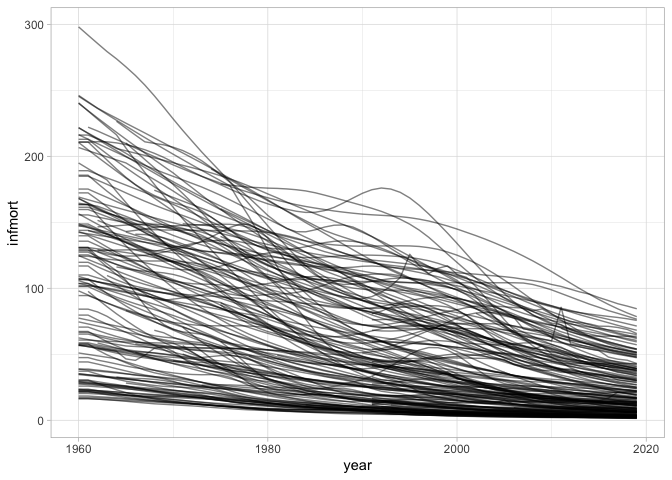
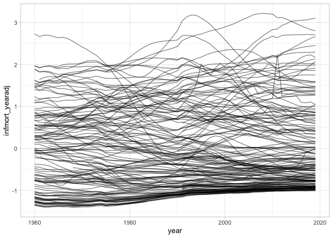

WDI Infant mortality
================

*Last updated on: 2020-04-11*

Infant mortality data for all countries, 1960 on.

  - The WDI indicator used for this is “SP.DYN.IMRT.IN”.
  - The data were changed to conform as much as possible to the
    Gleditsch & Ward state list.
  - The data are lagged 1 year so that there are 2019 values; the
    resulting missing values for 1960 or the first year of independence
    if it was after 1960 are imputed by using the original 1960/first
    year of ind. value, i.e. carry back imputed.
  - Several countries miss early portions of the data series, e.g. for
    the 50s and 60s. Missing values for those series were imputed using
    a linear model on the square root of infant mortality,
    \(\sqrt{Y} = a + b\times\textrm{Year}\), where *a* was picked so
    that the imputed values lined up with the first non-missing
    observation.
  - “infmort\_yearadj” is a scaled version adjusted for annual mean and
    sd.

<!-- end list -->

``` r
library(ggplot2)

df <- read.csv("output/wdi-infmort.csv")

str(df)
```

    ## 'data.frame':    9203 obs. of  5 variables:
    ##  $ gwcode         : int  2 2 2 2 2 2 2 2 2 2 ...
    ##  $ year           : int  1960 1961 1962 1963 1964 1965 1966 1967 1968 1969 ...
    ##  $ infmort        : num  25.9 25.9 25.4 24.9 24.4 23.8 23.3 22.7 22 21.3 ...
    ##  $ infmort_yearadj: num  -1.22 -1.24 -1.25 -1.25 -1.24 ...
    ##  $ infmort_imputed: logi  FALSE FALSE FALSE FALSE FALSE FALSE ...

``` r
ggplot(df, aes(x = year, y = infmort, group = gwcode)) +
  geom_line(alpha = 0.5) +
  theme_light()
```

<!-- -->

``` r
# Scaled version that is adjusted for annual mean and sd
ggplot(df, aes(x = year, y = infmort_yearadj, group = gwcode)) +
  geom_line(alpha = 0.5) +
  theme_light()
```

<!-- -->

## Data cleaning

See [clean-data.md](clean-data.md) for results of the data cleaning
script.
