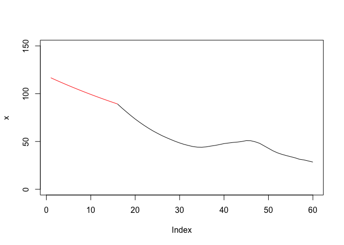
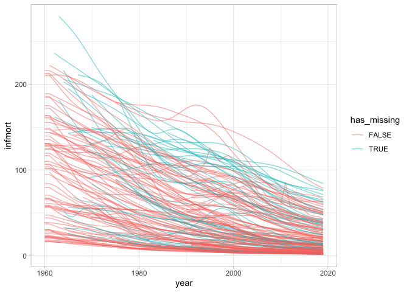
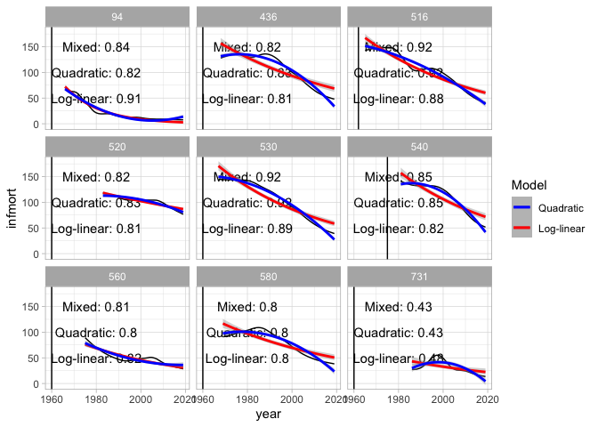
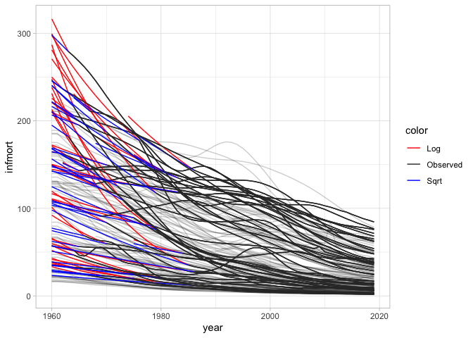

WDI Infant mortality
================

  - [Functions / packages](#functions-packages)
  - [Get raw data](#get-raw-data)
  - [Clean raw data](#clean-raw-data)
      - [Lag data](#lag-data)
      - [Normalize to G\&W statelist](#normalize-to-gw-statelist)
  - [Handle missing values](#handle-missing-values)
      - [Carry-back impute lag-induced missing
        data](#carry-back-impute-lag-induced-missing-data)
      - [Check remaining missing
        values](#check-remaining-missing-values)
      - [Find imputation model](#find-imputation-model)
  - [Add year-normalized version](#add-year-normalized-version)
  - [Done, save](#done-save)

*Last updated on 11 April 2020*

Note that places that require attention during data updates are marked
with *UPDATE:*

## Functions / packages

``` r
library(WDI)
library(tidyverse)
```

    ## ── Attaching packages ─────────────────────────────────────────────── tidyverse 1.2.1 ──

    ## ✓ ggplot2 3.2.1     ✓ purrr   0.3.3
    ## ✓ tibble  3.0.0     ✓ dplyr   0.8.5
    ## ✓ tidyr   1.0.2     ✓ stringr 1.4.0
    ## ✓ readr   1.3.1     ✓ forcats 0.5.0

    ## Warning: package 'tibble' was built under R version 3.6.2

    ## ── Conflicts ────────────────────────────────────────────────── tidyverse_conflicts() ──
    ## x dplyr::filter() masks stats::filter()
    ## x dplyr::lag()    masks stats::lag()

``` r
library(states)
```

    ## 
    ## Attaching package: 'states'

    ## The following object is masked from 'package:readr':
    ## 
    ##     parse_date

``` r
library(lubridate)
```

    ## 
    ## Attaching package: 'lubridate'

    ## The following objects are masked from 'package:dplyr':
    ## 
    ##     intersect, setdiff, union

    ## The following objects are masked from 'package:base':
    ## 
    ##     date, intersect, setdiff, union

``` r
library(stringr)

wdi_to_gw <- function(x, iso2c = "iso2c", country = "country", year = "year") {
  
  # In case the ID columns don't match the WDI default, create them here. 
  # dplyr is easier to use when we can refer to these columns directly
  x$iso2c   <- x[[iso2c]]
  x$country <- x[[country]]
  x$year    <- x[[year]]
  
  # remove non-state entities, i.e. regions and aggregates
  notstate <- c("1A", "1W", "4E", "7E", "8S", "B8", "F1", "S1", "S2", "S3", "S4",
                "T2", "T3", "T4", "T5", "T6", "T7", "V1", "V2", "V3", "V4", "Z4",
                "Z7", "EU", "OE", "XC", "XD", "XE", "XF", "XG", "XH", "XI", "XJ",
                "XL", "XM", "XN", "XO", "XP", "XQ", "XT", "XU", "XY", "ZF", "ZG",
                "ZJ", "ZQ", "ZT")
  x <- x %>%
    dplyr::filter(!iso2c %in% notstate) 
  
  # first pass G&W country code coding
  x$gwcode <- suppressWarnings(countrycode::countrycode(x[["iso2c"]], "iso2c", "gwn"))

  # this misses some countries; first the fixed, non-year-varying, cases
  x <- x %>%
    mutate(
      gwcode = case_when(
        iso2c=="AD" ~ 232L,
        iso2c=="XK" ~ 347L,
        country=="Namibia" ~ 565L,
        iso2c=="VN" ~ 816L,  # countrycode uses 817, South Vietnam for this
        iso2c=="YE" ~ 678L,  # Yemen
        TRUE ~ gwcode
      )
    )

  # Fix Serbia/Yugoslavia
  # Right now all coded as 340, but in G&W 345 (Yugo) ends in 2006 and 
  # 340 (Serbia) starts
  serbia2006 <- x[x$gwcode==340 & x$year==2006 & !is.na(x$gwcode), ]
  yugo_idx <- x$gwcode==340 & x$year < 2007 & !is.na(x$gwcode)
  x$gwcode[yugo_idx]  <- 345
  x$iso2c[yugo_idx]   <- "YU"
  x$country[yugo_idx] <- "Yugoslavia/Serbia & Montenegro"
  x <- bind_rows(x, serbia2006) %>%
    arrange(gwcode, iso2c, country, year)
  
  x
}


# I'm going to use this function to impute missing values; see below for more details and the choice of a log-linear model
impute_ts_loglinear <- function(x) {
  # This is only meant to work for leading NAs; check to make sure this is 
  # the case. 
  xna <- is.na(x)
  # if all NA's are leading sequence, they are all preceded by NA as well
  stopifnot(!any(xna==TRUE & c(TRUE, head(stats::lag(xna), -1))==FALSE))
  
  if (all(is.na(x))) {
    return(x)
  }
  xx <- seq_along(x)
  mdl <- try(glm(x ~ xx, data = NULL, family = gaussian(link = "log")), silent = TRUE)
  if (inherits(mdl, "try-error")) {
    return(x)
  }
  xhat <- predict(mdl, newdata = list(xx = xx), type = "response")
  
  # Use the first overlapping point to shift xhat so the lines "connect" instead
  # of having a sudden jump
  pt <- min(which(!xna))
  shift <- x[pt] - xhat[pt]
  xhat  <- xhat + shift
  
  # drop in imputed values
  x[xna] <- xhat[xna]
  x
}

impute_ts_sqrt <- function(x) {
  # This is only meant to work for leading NAs; check to make sure this is 
  # the case. 
  xna <- is.na(x)
  # if all NA's are leading sequence, they are all preceded by NA as well
  stopifnot(!any(xna==TRUE & c(TRUE, head(stats::lag(xna), -1))==FALSE))
  
  if (all(is.na(x))) {
    return(x)
  }
  xx <- seq_along(x)
  mdl <- try(glm(sqrt(x) ~ xx, data = NULL, family = gaussian(link = "identity")), silent = TRUE)
  if (inherits(mdl, "try-error")) {
    return(x)
  }
  xhat <- predict(mdl, newdata = list(xx = xx), type = "response")^2
  
  # Use the first overlapping point to shift xhat so the lines "connect" instead
  # of having a sudden jump
  pt <- min(which(!xna))
  shift <- x[pt] - xhat[pt]
  xhat  <- xhat + shift
  
  # drop in imputed values
  x[xna] <- xhat[xna]
  x
}

# check how this works
x <- c(NA, NA, NA, NA, NA, NA, NA, NA, NA, NA, NA, NA, NA, NA, NA, 
       89.3, 85.1, 81.1, 77.2, 73.5, 70.1, 66.9, 63.9, 61.1, 58.6, 56.2, 
       54.1, 52.1, 50.2, 48.5, 47, 45.8, 44.7, 44.1, 44, 44.4, 45.2, 
       45.9, 46.8, 47.8, 48.4, 49, 49.4, 50, 50.9, 50.8, 49.7, 48.1, 
       45.5, 42.9, 40.3, 38.2, 36.6, 35.3, 34.1, 32.9, 31.4, 30.7, 29.6, 
       28.5)
plot(x, type = "l", ylim = c(0, 150))
lines(impute_ts_loglinear(x)[1:16], col = "red")
```

<!-- -->

## Get raw data

Download the raw source data. Since this takes a while, this will only
raw if a copy of the source data is not present in the input folder.

*UPDATE: To trigger and update, delete the raw data input file or
manually run this chunk.*

``` r
if (!file.exists("input/infmort.csv")) {
  raw <- WDI(indicator = "infmort", country = "all", start = 1960, 
           end = year(today()), extra = FALSE)
  write_csv(raw, "input/infmort.csv")
}
```

## Clean raw data

``` r
raw <- read_csv("input/infmort.csv")
```

    ## Parsed with column specification:
    ## cols(
    ##   iso2c = col_character(),
    ##   country = col_character(),
    ##   SP.DYN.IMRT.IN = col_double(),
    ##   year = col_double()
    ## )

``` r
# UPDATE: check this is still the case
# In the raw data all values for 2019 are missing; drop that year from the data
last_year <- filter(raw, year==max(year))
stopifnot(all(is.na(last_year[["SP.DYN.IMRT.IN"]])))
raw <- filter(raw, year!=max(year))

# convert to G&W system
wdi <- raw %>%
  rename(infmort = SP.DYN.IMRT.IN) %>%
  wdi_to_gw(.) %>%
  arrange(gwcode, year)

# Some minor countries don't have G&W codes
nogwcode <- wdi %>%
  filter(is.na(gwcode)) %>%
  group_by(iso2c, country) %>%
  count() 
write_csv(nogwcode, "output/missing-gwcode.csv")
knitr::kable(nogwcode)
```

| iso2c | country                        |  n |
| :---- | :----------------------------- | -: |
| AG    | Antigua and Barbuda            | 59 |
| AS    | American Samoa                 | 59 |
| AW    | Aruba                          | 59 |
| BM    | Bermuda                        | 59 |
| CW    | Curacao                        | 59 |
| DM    | Dominica                       | 59 |
| FM    | Micronesia, Fed. Sts.          | 59 |
| FO    | Faroe Islands                  | 59 |
| GD    | Grenada                        | 59 |
| GI    | Gibraltar                      | 59 |
| GL    | Greenland                      | 59 |
| GU    | Guam                           | 59 |
| HK    | Hong Kong SAR, China           | 59 |
| IM    | Isle of Man                    | 59 |
| JG    | Channel Islands                | 59 |
| KI    | Kiribati                       | 59 |
| KN    | St. Kitts and Nevis            | 59 |
| KY    | Cayman Islands                 | 59 |
| LC    | St. Lucia                      | 59 |
| LI    | Liechtenstein                  | 59 |
| MC    | Monaco                         | 59 |
| MF    | St. Martin (French part)       | 59 |
| MH    | Marshall Islands               | 59 |
| MO    | Macao SAR, China               | 59 |
| MP    | Northern Mariana Islands       | 59 |
| NC    | New Caledonia                  | 59 |
| NR    | Nauru                          | 59 |
| PF    | French Polynesia               | 59 |
| PR    | Puerto Rico                    | 59 |
| PS    | West Bank and Gaza             | 59 |
| PW    | Palau                          | 59 |
| SC    | Seychelles                     | 59 |
| SM    | San Marino                     | 59 |
| ST    | Sao Tome and Principe          | 59 |
| SX    | Sint Maarten (Dutch part)      | 59 |
| TC    | Turks and Caicos Islands       | 59 |
| TO    | Tonga                          | 59 |
| TV    | Tuvalu                         | 59 |
| VC    | St. Vincent and the Grenadines | 59 |
| VG    | British Virgin Islands         | 59 |
| VI    | Virgin Islands (U.S.)          | 59 |
| VU    | Vanuatu                        | 59 |
| WS    | Samoa                          | 59 |

``` r
# Take those out
wdi <- wdi %>%
  dplyr::filter(!is.na(gwcode))
```

### Lag data

*UPDATE: make sure the lagging is still correct*

Lag the data before we check for an if possible impute missing values
because the lagging will introduce missingness as well.

``` r
wdi$year <- wdi$year + 1
range(wdi$year)
```

    ## [1] 1961 2019

### Normalize to G\&W statelist

``` r
# Add in missing cases from G&W state list and drop excess country-years not 
# in G&W list (left join)
statelist <- state_panel(1960,  # this cannot be min(year) because we lagged above
                         max(wdi$year), partial = "any")
wdi <- left_join(statelist, wdi, by = c("gwcode", "year")) %>%
  arrange(gwcode, year)
```

\*TODO: this join will take out some excess years for situations where
WDI is missing data for a country like Czechoslovakia that later split
into several different countries, and for which it does have data. In
principle it might be possible to reconstruct mortality estimates for
Czechoslovakia, the USSR, Yugoslavia, Sudan, etc. but this is a lot of
work, so ¯\_(ツ)\_/¯\*

## Handle missing values

The rest of this script deals with identifying and potentially imputing
missing values.

``` r
# Are any years completely missing?
missing_year <- wdi %>%
  group_by(year) %>%
  summarize(n = n(), missing = sum(infmort)) %>%
  filter(n==missing) 
write_csv(missing_year, "output/missing-all-year.csv")
missing_year %>%
  knitr::kable()
```

| year | n | missing |
| ---: | -: | ------: |

``` r
# This should not be the case since we lagged the data
stopifnot(nrow(missing_year)==0)

# Are any countries completely missing?
missing_country <- wdi %>%
  group_by(gwcode) %>%
  summarize(n = n(), 
            missing = sum(is.na(infmort))) %>%
  mutate(country = country_names(gwcode, shorten = TRUE)) %>%
  filter(n==missing) %>%
  select(gwcode, country, n)
write_csv(missing_country, "output/missing-all-country.csv")
missing_country %>%
  knitr::kable()
```

| gwcode | country                    |  n |
| -----: | :------------------------- | -: |
|     54 | Dominica                   | 42 |
|     55 | Grenada                    | 46 |
|     56 | Saint Lucia                | 41 |
|     57 | Saint Vincent              | 41 |
|     58 | Antigua & Barbuda          | 39 |
|     60 | Saint Kitts and Nevis      | 37 |
|    221 | Monaco                     | 60 |
|    223 | Liechtenstein              | 60 |
|    265 | German Democratic Republic | 31 |
|    315 | Czechoslovakia             | 33 |
|    331 | San Marino                 | 60 |
|    347 | Kosovo                     | 12 |
|    396 | Abkhazia                   | 12 |
|    397 | South Ossetia              | 12 |
|    403 | Sao Tome and Principe      | 45 |
|    511 | Zanzibar                   |  2 |
|    591 | Seychelles                 | 44 |
|    680 | South Yemen                | 24 |
|    713 | Taiwan                     | 60 |
|    817 | South Vietnam              | 16 |
|    935 | Vanuatu                    | 40 |
|    970 | Kiribati                   | 41 |
|    971 | Nauru                      | 52 |
|    972 | Tonga                      | 50 |
|    973 | Tuvalu                     | 42 |
|    983 | Marshall Islands           | 34 |
|    986 | Palau                      | 26 |
|    987 | Micronesia                 | 34 |
|    990 | Samoa/Western Samoa        | 58 |

``` r
# Take out countries missing all values
wdi <- wdi %>% 
  dplyr::filter(!gwcode %in% missing_country[["gwcode"]])
```

### Carry-back impute lag-induced missing data

Because we lagged the data, countries will have missing values in 1960
or their first year of independence, if it was after 1960. Use the 1960
or independence year value to impute, i.e. carry back impute thoses
cases.

``` r
# Countries that gained indy in 1960 or later
data(gwstates)
indy <- gwstates %>% 
  # some states are present more than 1 time if they had interrupted indy; only
  # use last period
  arrange(gwcode) %>%
  group_by(gwcode) %>% 
  slice(n()) %>%
  mutate(syear = lubridate::year(start)) %>%
  select(gwcode, syear)
stopifnot(nrow(indy)==length(unique(indy$gwcode)))

wdi <- wdi %>%
  left_join(indy, by = "gwcode") %>%
  group_by(gwcode) %>%
  arrange(gwcode, year) %>%
  mutate(infmort2 = case_when(
    (is.na(infmort) & year>=syear) ~ lead(infmort, n = 1)[1],
    TRUE ~ infmort
  ))

# I add the imputed values as second column to allow comparison, if one wants
# to do that at this point. 
sum(is.na(wdi$infmort))
```

    ## [1] 559

``` r
sum(is.na(wdi$infmort2))
```

    ## [1] 491

``` r
wdi <- wdi %>%
  mutate(infmort = infmort2, infmort2 = NULL)
```

### Check remaining missing values

``` r
missing <- wdi %>%
  # Track the original N for a country before focusing only on missing cases
  group_by(gwcode) %>%
  dplyr::mutate(N = n()) %>%
  filter(is.na(infmort)) %>%
  # Right now this is country-year; turn this into a more readable form by 
  # collapsing accross consecutive year spells
  # First, code consecutive year spells
  group_by(gwcode) %>%
  arrange(year) %>%
  dplyr::mutate(year = as.integer(year),
                id = id_date_sequence(year)) %>%
  # Collapse over years
  dplyr::group_by(gwcode, id) %>%
  dplyr::summarize(N = unique(N), 
                   N_miss = n(),
                   Frac_miss = N_miss/N,
                   years = paste0(range(year), collapse = " - ")) %>%
  select(-id) %>%
  arrange(desc(Frac_miss), gwcode)

missing %>% 
  knitr::kable()
```

| gwcode |  N | N\_miss | Frac\_miss | years       |
| -----: | -: | ------: | ---------: | :---------- |
|    345 | 47 |      25 |  0.5319149 | 1960 - 1984 |
|    232 | 60 |      26 |  0.4333333 | 1960 - 1985 |
|    731 | 60 |      26 |  0.4333333 | 1960 - 1985 |
|    520 | 60 |      23 |  0.3833333 | 1960 - 1982 |
|    352 | 60 |      20 |  0.3333333 | 1960 - 1979 |
|    339 | 60 |      19 |  0.3166667 | 1960 - 1978 |
|    481 | 60 |      19 |  0.3166667 | 1960 - 1978 |
|    712 | 60 |      19 |  0.3166667 | 1960 - 1978 |
|    812 | 60 |      19 |  0.3166667 | 1960 - 1978 |
|    411 | 52 |      15 |  0.2884615 | 1968 - 1982 |
|    811 | 60 |      16 |  0.2666667 | 1960 - 1975 |
|    404 | 46 |      12 |  0.2608696 | 1974 - 1985 |
|    230 | 60 |      15 |  0.2500000 | 1960 - 1974 |
|    560 | 60 |      15 |  0.2500000 | 1960 - 1974 |
|    666 | 60 |      15 |  0.2500000 | 1960 - 1974 |
|    483 | 60 |      13 |  0.2166667 | 1960 - 1972 |
|    670 | 60 |      13 |  0.2166667 | 1960 - 1972 |
|    115 | 45 |       9 |  0.2000000 | 1975 - 1983 |
|    630 | 60 |      12 |  0.2000000 | 1960 - 1971 |
|    365 | 60 |      11 |  0.1833333 | 1960 - 1970 |
|    160 | 60 |      10 |  0.1666667 | 1960 - 1969 |
|    490 | 60 |      10 |  0.1666667 | 1960 - 1969 |
|    710 | 60 |      10 |  0.1666667 | 1960 - 1969 |
|    760 | 60 |      10 |  0.1666667 | 1960 - 1969 |
|    260 | 60 |       9 |  0.1500000 | 1960 - 1968 |
|    580 | 60 |       9 |  0.1500000 | 1960 - 1968 |
|    775 | 60 |       9 |  0.1500000 | 1960 - 1968 |
|    436 | 60 |       8 |  0.1333333 | 1960 - 1967 |
|    540 | 45 |       6 |  0.1333333 | 1975 - 1980 |
|    530 | 60 |       7 |  0.1166667 | 1960 - 1966 |
|     94 | 60 |       6 |  0.1000000 | 1960 - 1965 |
|    212 | 60 |       5 |  0.0833333 | 1960 - 1964 |
|    475 | 60 |       5 |  0.0833333 | 1960 - 1964 |
|    816 | 60 |       5 |  0.0833333 | 1960 - 1964 |
|     40 | 60 |       4 |  0.0666667 | 1960 - 1963 |
|    355 | 60 |       4 |  0.0666667 | 1960 - 1963 |
|    360 | 60 |       4 |  0.0666667 | 1960 - 1963 |
|    432 | 60 |       4 |  0.0666667 | 1960 - 1963 |
|    438 | 60 |       4 |  0.0666667 | 1960 - 1963 |
|    698 | 60 |       4 |  0.0666667 | 1960 - 1963 |
|    553 | 56 |       3 |  0.0535714 | 1964 - 1966 |
|    516 | 58 |       3 |  0.0517241 | 1962 - 1964 |
|    616 | 60 |       3 |  0.0500000 | 1960 - 1962 |
|    678 | 60 |       3 |  0.0500000 | 1960 - 1962 |
|    482 | 60 |       2 |  0.0333333 | 1960 - 1961 |
|    700 | 60 |       2 |  0.0333333 | 1960 - 1961 |

``` r
# add an indicator if series is incomplete 
wdi <- wdi %>%
  mutate(has_missing = gwcode %in% missing$gwcode)
```

These are all missing values at the front of the series.

### Find imputation model

The series overall look like the might be reasonably linear under some
scale transformation like log or square root.

``` r
ggplot(wdi, aes(x = year, y = infmort, group = gwcode, 
                color = has_missing)) +
  geom_line(alpha = 0.5) +
  theme_light()
```

    ## Warning: Removed 491 rows containing missing values (geom_path).

<!-- -->

Compare log-linear and square root linear models.

``` r
fit <- wdi %>%
  group_by(gwcode, has_missing) %>%
  nest() %>%
  mutate(
    mdl_log = map(data, ~lm(log(infmort) ~ year, data = .)),
    mdl_sqrt = map(data, ~lm(sqrt(infmort) ~ year, data = .)),
    mdl_mix  = map(data, ~lm((infmort)^(0.42) ~ year, data = .))
  ) %>%
  gather(model, fit, starts_with("mdl")) %>%
  mutate(r2 = map_dbl(fit, ~summary(.)$r.squared))

# Bin the fit by R^2 and model
table(fit$model, cut(fit$r2, c(0, .4, .5, .6, .7, .8, .9, 1)))
```

    ##           
    ##            (0,0.4] (0.4,0.5] (0.5,0.6] (0.6,0.7] (0.7,0.8] (0.8,0.9] (0.9,1]
    ##   mdl_log        0         2         1         3         4        15     149
    ##   mdl_mix        0         2         1         3         4        19     145
    ##   mdl_sqrt       0         2         1         3         3        21     144

``` r
fit %>% 
  group_by(model, has_missing) %>%
  summarize(countries = n(),
            mean_r2 = round(mean(r2), 2),
            median_r2 = round(median(r2), 2)) %>%
  arrange(has_missing, mean_r2)
```

    ## # A tibble: 6 x 5
    ## # Groups:   model [3]
    ##   model    has_missing countries mean_r2 median_r2
    ##   <chr>    <lgl>           <int>   <dbl>     <dbl>
    ## 1 mdl_sqrt FALSE             128    0.93      0.96
    ## 2 mdl_log  FALSE             128    0.94      0.97
    ## 3 mdl_mix  FALSE             128    0.94      0.96
    ## 4 mdl_mix  TRUE               46    0.93      0.96
    ## 5 mdl_sqrt TRUE               46    0.93      0.96
    ## 6 mdl_log  TRUE               46    0.94      0.97

If a model is not performing well on a series where wer are not looking
to impute, who cares. Look at low R2 models for series we are looking to
impute.

``` r
check_gwcodes <- fit %>% 
  filter(model!="mdl_lm", r2 < 0.9, has_missing) %>% 
  pull(gwcode) %>% 
  unique()
bad_fit <- fit %>%
  filter(gwcode %in% check_gwcodes, model!="mdl_lm") 
nn <- nrow(bad_fit)/3
wdi %>%
  filter(gwcode %in% check_gwcodes) %>%
  mutate(syear = ifelse(syear<1960, 1960, syear)) %>%
  ggplot(.) +
  facet_wrap(~ gwcode) +
  geom_line(aes(x = year, y = infmort, group = gwcode)) +
  # mark how far back we need to impute
  geom_vline(aes(xintercept = syear)) +
  geom_text(
    data = bad_fit, 
    x = 1980, 
    y = c(rep(50, nn), rep(100, nn), rep(150, nn)), 
    aes(label = paste0(
      c(rep("Log-linear: ", nn), rep("Quadratic: ", nn), 
      rep("Mixed: ", nn)),
      round(r2, 2))
    )
  ) +
  stat_smooth(aes(x = year, y = infmort, color = "red"),
              method = "glm", 
              formula = y ~ x, 
              method.args = list(family = gaussian(link = "log"))) +
  stat_smooth(aes(x = year, y = infmort, color = "blue"),
              method = "lm",
              formula = y ~ poly(x, 2)) +
  scale_color_manual("Model", values = c("red" = "red", "blue" = "blue"), 
                     labels = c("blue" = "Quadratic", "red" = "Log-linear")) +
  theme_light()
```

    ## Warning: Removed 103 rows containing non-finite values (stat_smooth).
    
    ## Warning: Removed 103 rows containing non-finite values (stat_smooth).

    ## Warning: Removed 103 rows containing missing values (geom_path).

<!-- -->

The log-lienar and square root models both perform about equally well.
What do the imputed values look like?

``` r
wdi <- wdi %>%
  group_by(gwcode) %>%
  arrange(gwcode, year) %>%
  mutate(infmort_imputed = is.na(infmort),
         infmort_log     = impute_ts_loglinear(infmort),
         infmort_sqrt    = impute_ts_sqrt(infmort))

# Visualize results
highlight <- wdi %>% 
  filter(has_missing) %>%
  select(gwcode, year, infmort_imputed, infmort_log, infmort_sqrt) %>%
  pivot_longer(infmort_log:infmort_sqrt) %>%
  mutate(color = case_when(
    infmort_imputed==FALSE ~ "Observed",
    infmort_imputed==TRUE & name=="infmort_log" ~ "Log",
    infmort_imputed==TRUE & name=="infmort_sqrt" ~ "Sqrt",
    TRUE ~ "what?"
  ))
ggplot(wdi, aes(x = year)) +
  geom_line(aes(y = infmort, group = gwcode), alpha = 0.2) +
  geom_line(data = highlight,
            aes(y = value, group = interaction(gwcode, name), color = color)) +
  scale_color_manual(values = c("Observed" = "gray20", "Log" = "red", "Sqrt" = "blue")) +
  theme_light()
```

    ## Warning: Removed 491 rows containing missing values (geom_path).

<!-- -->

The square root model’s imputed values are less aggressive in their
extrapolation so I will pick that.

``` r
wdi <- wdi %>%
  mutate(infmort = infmort_sqrt,
         infmort_log = NULL)
```

Now all the countries we have not dropped should have full series / no
missing values.

``` r
tbl <- wdi %>%
  group_by(gwcode) %>%
  summarize(n_miss = sum(is.na(infmort))) %>%
  ungroup() %>%
  filter(n_miss > 0)
if (nrow(tbl) > 0) stop("Still some missing values remaining", call. = FALSE)
```

## Add year-normalized version

``` r
wdi <- wdi %>%
  group_by(year) %>%
  mutate(infmort_yearadj = (infmort - mean(infmort))/sd(infmort)) %>%
  ungroup()
```

## Done, save

``` r
wdi <- wdi %>% 
  ungroup() %>%
  select(gwcode, year, infmort, infmort_yearadj, infmort_imputed) 
write_csv(wdi, path = "output/wdi-infmort.csv")
```
