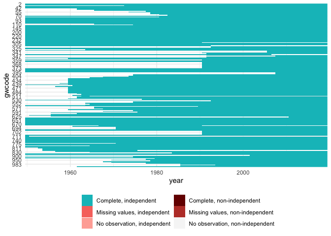
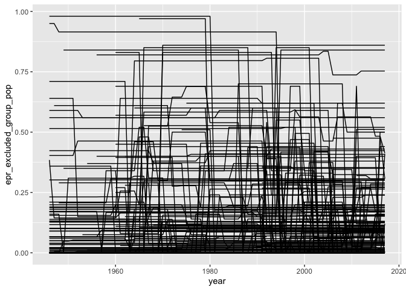
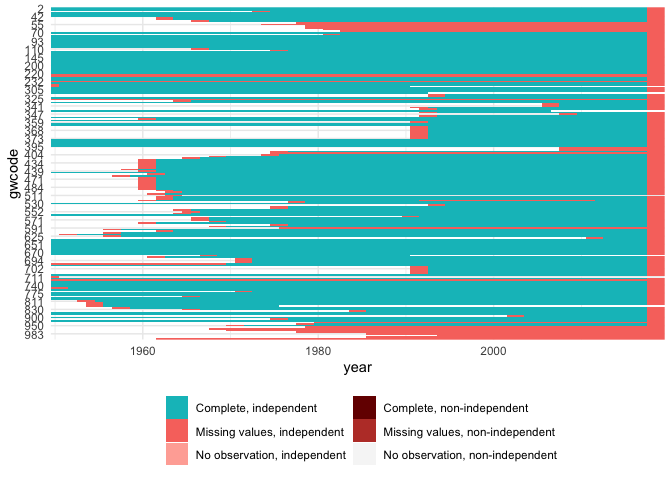

Combine data into states.rds
================

  - [Pieces](#pieces)
      - [Master statelist](#master-statelist)
      - [P\&T coups](#pt-coups)
      - [Make lead DV versions](#make-lead-dv-versions)
  - [G\&W state age](#gw-state-age)
  - [EPR](#epr)
  - [REIGN data](#reign-data)
  - [V-Dem](#v-dem)
  - [Summarize and write output](#summarize-and-write-output)
      - [Variables in data](#variables-in-data)
      - [Missing values by column](#missing-values-by-column)
      - [Track overall cases and missing
        cases](#track-overall-cases-and-missing-cases)
  - [Save](#save)

## Pieces

### Master statelist

``` r
states <- state_panel(1950, 2019, partial = "any")
```

### P\&T coups

``` r
ptcoups <- read_csv("input/ptcoups.csv")
```

    ## Parsed with column specification:
    ## cols(
    ##   .default = col_double()
    ## )

    ## See spec(...) for full column specifications.

``` r
glimpse(ptcoups)
```

    ## Rows: 11,202
    ## Columns: 20
    ## $ gwcode                      <dbl> 2, 2, 2, 2, 2, 2, 2, 2, 2, 2, 2, 2, 2, 2,…
    ## $ year                        <dbl> 1950, 1951, 1952, 1953, 1954, 1955, 1956,…
    ## $ pt_attempt                  <dbl> 0, 0, 0, 0, 0, 0, 0, 0, 0, 0, 0, 0, 0, 0,…
    ## $ pt_attempt_num              <dbl> 0, 0, 0, 0, 0, 0, 0, 0, 0, 0, 0, 0, 0, 0,…
    ## $ pt_coup_num                 <dbl> 0, 0, 0, 0, 0, 0, 0, 0, 0, 0, 0, 0, 0, 0,…
    ## $ pt_coup                     <dbl> 0, 0, 0, 0, 0, 0, 0, 0, 0, 0, 0, 0, 0, 0,…
    ## $ pt_failed_num               <dbl> 0, 0, 0, 0, 0, 0, 0, 0, 0, 0, 0, 0, 0, 0,…
    ## $ pt_failed                   <dbl> 0, 0, 0, 0, 0, 0, 0, 0, 0, 0, 0, 0, 0, 0,…
    ## $ pt_coup_total               <dbl> 0, 0, 0, 0, 0, 0, 0, 0, 0, 0, 0, 0, 0, 0,…
    ## $ pt_failed_total             <dbl> 0, 0, 0, 0, 0, 0, 0, 0, 0, 0, 0, 0, 0, 0,…
    ## $ pt_attempt_total            <dbl> 0, 0, 0, 0, 0, 0, 0, 0, 0, 0, 0, 0, 0, 0,…
    ## $ pt_coup_num5yrs             <dbl> 0, 0, 0, 0, 0, 0, 0, 0, 0, 0, 0, 0, 0, 0,…
    ## $ pt_failed_num5yrs           <dbl> 0, 0, 0, 0, 0, 0, 0, 0, 0, 0, 0, 0, 0, 0,…
    ## $ pt_attempt_num5yrs          <dbl> 0, 0, 0, 0, 0, 0, 0, 0, 0, 0, 0, 0, 0, 0,…
    ## $ pt_coup_num10yrs            <dbl> 0, 0, 0, 0, 0, 0, 0, 0, 0, 0, 0, 0, 0, 0,…
    ## $ pt_failed_num10yrs          <dbl> 0, 0, 0, 0, 0, 0, 0, 0, 0, 0, 0, 0, 0, 0,…
    ## $ pt_attempt_num10yrs         <dbl> 0, 0, 0, 0, 0, 0, 0, 0, 0, 0, 0, 0, 0, 0,…
    ## $ years_since_last_pt_coup    <dbl> 1, 2, 3, 4, 5, 6, 7, 8, 9, 10, 11, 12, 13…
    ## $ years_since_last_pt_failed  <dbl> 1, 2, 3, 4, 5, 6, 7, 8, 9, 10, 11, 12, 13…
    ## $ years_since_last_pt_attempt <dbl> 1, 2, 3, 4, 5, 6, 7, 8, 9, 10, 11, 12, 13…

``` r
plotmiss(ptcoups)
```

<!-- -->

``` r
states <- left_join(states, ptcoups, by = c("gwcode", "year"))
```

### Make lead DV versions

``` r
dv_vars <- ptcoups %>%
  select(gwcode, year, pt_attempt, pt_coup, pt_failed) 
lead1 <- dv_vars %>%
  mutate(year = year - 1) %>%
  rename(pt_attempt_lead1 = pt_attempt, pt_coup_lead1 = pt_coup, 
         pt_failed_lead1 = pt_failed)
lead2 <- dv_vars %>%
  mutate(year = year - 2) %>%
  rename(pt_attempt_lead2 = pt_attempt, pt_coup_lead2 = pt_coup, 
         pt_failed_lead2 = pt_failed)
dv <- full_join(lead1, lead2)
```

    ## Joining, by = c("gwcode", "year")

Cuba had an attempt in 1952, check data are correct for this:

``` r
cuba <- dv %>%
  filter(gwcode==40 & year < 1953) %>%
  arrange(year) %>%
  select(gwcode, year, pt_coup_lead1, pt_coup_lead2)

cuba
```

    ## # A tibble: 5 x 4
    ##   gwcode  year pt_coup_lead1 pt_coup_lead2
    ##    <dbl> <dbl>         <dbl>         <dbl>
    ## 1     40  1948            NA             0
    ## 2     40  1949             0             0
    ## 3     40  1950             0             1
    ## 4     40  1951             1             0
    ## 5     40  1952             0             0

``` r
stopifnot(cuba$pt_coup_lead1[cuba$year==1951] == 1,
          cuba$pt_coup_lead2[cuba$year==1950] == 1)
```

#### Impute for last 2 years in state existence

Several states drop out during the data period. Set the DV vars to 0 in
those instances.

``` r
last2 <- function(x, yy, ly) {
  ifelse(is.na(x) & yy >= ly - 1, 0L, x)
}

dv_full <- left_join(states, dv) %>%
  select(gwcode, year, contains("lead")) %>%
  group_by(gwcode) %>%
  mutate(last_year = max(year),
         # states with last year in 2019 still exist
         last_year = ifelse(last_year==max(states$year), 9999L, last_year)) %>%
  mutate_at(.vars = vars(contains("lead")), ~last2(., year, last_year)) %>%
  select(-last_year)
```

    ## Joining, by = c("gwcode", "year")

``` r
states <- left_join(states, dv_full)
```

    ## Joining, by = c("gwcode", "year")

## G\&W state age

Years since independence

``` r
age <- read_csv("input/gwstate-age.csv") %>%
  mutate(ln_state_age = log(state_age)) %>%
  select(-state_age)
```

    ## Parsed with column specification:
    ## cols(
    ##   gwcode = col_double(),
    ##   year = col_double(),
    ##   state_age = col_double()
    ## )

``` r
states <- left_join(states, age, by = c("gwcode", "year"))
```

## EPR

Ethnic Power Relations data on ethnic groups in countries.

``` r
epr <- read_csv("input/epr.csv") %>%
  setNames(c("gwcode", "year", paste0("epr_", names(.)[3:ncol(.)])))
```

    ## Parsed with column specification:
    ## cols(
    ##   gwcode = col_double(),
    ##   year = col_double(),
    ##   groups = col_double(),
    ##   elf = col_double(),
    ##   excluded_groups_count = col_double(),
    ##   excluded_group_pop = col_double(),
    ##   inpower_groups_count = col_double(),
    ##   inpower_groups_pop = col_double(),
    ##   regaut_groups_count = col_double(),
    ##   regaut_group_pop = col_double()
    ## )

``` r
glimpse(epr)
```

    ## Rows: 11,128
    ## Columns: 10
    ## $ gwcode                    <dbl> 2, 2, 2, 2, 2, 2, 2, 2, 2, 2, 2, 2, 2, 2, 2…
    ## $ year                      <dbl> 1946, 1947, 1948, 1949, 1950, 1951, 1952, 1…
    ## $ epr_groups                <dbl> 6, 6, 6, 6, 6, 6, 6, 6, 6, 6, 6, 6, 6, 6, 6…
    ## $ epr_elf                   <dbl> 0.5098565, 0.5098565, 0.5098565, 0.5098565,…
    ## $ epr_excluded_groups_count <dbl> 2, 2, 2, 2, 2, 2, 2, 2, 2, 2, 2, 2, 2, 2, 2…
    ## $ epr_excluded_group_pop    <dbl> 0.1318, 0.1318, 0.1318, 0.1318, 0.1318, 0.1…
    ## $ epr_inpower_groups_count  <dbl> 4, 4, 4, 4, 4, 4, 4, 4, 4, 4, 4, 4, 4, 4, 4…
    ## $ epr_inpower_groups_pop    <dbl> 0.8562, 0.8562, 0.8562, 0.8562, 0.8562, 0.8…
    ## $ epr_regaut_groups_count   <dbl> 0, 0, 0, 0, 0, 0, 0, 0, 0, 0, 0, 0, 0, 0, 0…
    ## $ epr_regaut_group_pop      <dbl> 0, 0, 0, 0, 0, 0, 0, 0, 0, 0, 0, 0, 0, 0, 0…

Add year-to-year difference of these variables. Changes could be
significant.

``` r
TODO
```

EPR only ranges to 2017 right now. Lag and carry-back, or don’t lag but
do carry-forward from 2017 on?

``` r
ggplot(epr, aes(x = year, y = epr_excluded_group_pop, group = gwcode)) +
  geom_line()
```

    ## Warning: Removed 986 rows containing missing values (geom_path).

<!-- -->

There are quite frequent changes, as the plot above shows. Since I care
more about recent cases, and since it seems fair to assume that the
power structures pre-independence were similar to those at independence,
lag and carry back for first two years in state’s existence, for states
that enter after 1950.

``` r
epr_lagged <- epr %>%
  mutate(year = year + 2) %>%
  arrange(gwcode, year) %>%
  group_by(gwcode) %>%
  tidyr::fill(-gwcode, -year, .direction = "up")
```

``` r
states <- left_join(states, epr_lagged, by = c("gwcode", "year"))
```

## REIGN data

``` r
reign <- read_csv("input/reign-cy.csv") %>%
  setNames(., c("gwcode", "year", paste0("reign_", names(.)[3:ncol(.)])))
```

    ## Parsed with column specification:
    ## cols(
    ##   .default = col_double(),
    ##   government = col_character()
    ## )

    ## See spec(...) for full column specifications.

``` r
glimpse(reign)
```

    ## Rows: 11,031
    ## Columns: 30
    ## $ gwcode                <dbl> 2, 2, 2, 2, 2, 2, 2, 2, 2, 2, 2, 2, 2, 2, 2, 2,…
    ## $ year                  <dbl> 1950, 1951, 1952, 1953, 1954, 1955, 1956, 1957,…
    ## $ reign_elected         <dbl> 1, 1, 1, 1, 1, 1, 1, 1, 1, 1, 1, 1, 1, 0, 1, 1,…
    ## $ reign_age             <dbl> 66, 67, 68, 63, 64, 65, 66, 67, 68, 69, 70, 44,…
    ## $ reign_male            <dbl> 1, 1, 1, 1, 1, 1, 1, 1, 1, 1, 1, 1, 1, 1, 1, 1,…
    ## $ reign_militarycareer  <dbl> 0, 0, 0, 1, 1, 1, 1, 1, 1, 1, 1, 0, 0, 0, 0, 0,…
    ## $ reign_tenure_months   <dbl> 69, 81, 93, 12, 24, 36, 48, 60, 72, 84, 96, 12,…
    ## $ reign_government      <chr> "Presidential Democracy", "Presidential Democra…
    ## $ reign_anticipation    <dbl> 0, 0, 0, 0, 0, 0, 0, 0, 0, 0, 0, 0, 0, 0, 0, 0,…
    ## $ reign_ref_ant         <dbl> 0, 0, 0, 0, 0, 0, 0, 0, 0, 0, 0, 0, 0, 0, 0, 0,…
    ## $ reign_leg_ant         <dbl> 0, 0, 0, 0, 0, 0, 0, 0, 0, 0, 0, 0, 0, 0, 0, 0,…
    ## $ reign_exec_ant        <dbl> 0, 0, 0, 0, 0, 0, 0, 0, 0, 0, 0, 0, 0, 0, 0, 0,…
    ## $ reign_irreg_lead_ant  <dbl> 0, 0, 0, 0, 0, 0, 0, 0, 0, 0, 0, 0, 0, 0, 0, 0,…
    ## $ reign_election_now    <dbl> 0, 0, 0, 0, 0, 0, 0, 0, 0, 0, 0, 0, 0, 0, 0, 0,…
    ## $ reign_election_recent <dbl> 0, 0, 1, 0, 0, 0, 1, 0, 0, 0, 1, 0, 0, 0, 1, 0,…
    ## $ reign_leg_recent      <dbl> 0, 0, 0, 0, 0, 0, 0, 0, 0, 0, 0, 0, 0, 0, 0, 0,…
    ## $ reign_exec_recent     <dbl> 0, 0, 1, 0, 0, 0, 1, 0, 0, 0, 1, 0, 0, 0, 1, 0,…
    ## $ reign_lead_recent     <dbl> 0, 0, 1, 0, 0, 0, 1, 0, 0, 0, 1, 0, 0, 0, 1, 0,…
    ## $ reign_ref_recent      <dbl> 0, 0, 0, 0, 0, 0, 0, 0, 0, 0, 0, 0, 0, 0, 0, 0,…
    ## $ reign_direct_recent   <dbl> 0, 0, 1, 0, 0, 0, 1, 0, 0, 0, 1, 0, 0, 0, 1, 0,…
    ## $ reign_indirect_recent <dbl> 0, 0, 0, 0, 0, 0, 0, 0, 0, 0, 0, 0, 0, 0, 0, 0,…
    ## $ reign_victory_recent  <dbl> 0, 0, 0, 0, 0, 0, 1, 0, 0, 0, 0, 0, 0, 0, 1, 0,…
    ## $ reign_defeat_recent   <dbl> 0, 0, 1, 0, 0, 0, 0, 0, 0, 0, 1, 0, 0, 0, 0, 0,…
    ## $ reign_change_recent   <dbl> 0, 0, 1, 0, 0, 0, 0, 0, 0, 0, 1, 0, 0, 0, 0, 0,…
    ## $ reign_nochange_recent <dbl> 0, 0, 0, 0, 0, 0, 1, 0, 0, 0, 0, 0, 0, 0, 1, 0,…
    ## $ reign_delayed         <dbl> 0, 0, 0, 0, 0, 0, 0, 0, 0, 0, 0, 0, 0, 0, 0, 0,…
    ## $ reign_lastelection    <dbl> 3.2188759, 3.6109178, 0.6931472, 2.6390574, 3.2…
    ## $ reign_loss            <dbl> 5.3798971, 5.4337220, 0.6931472, 2.6390574, 3.2…
    ## $ reign_irregular       <dbl> 7.571474, 7.577634, 7.583756, 7.589842, 7.59589…
    ## $ reign_prev_conflict   <dbl> 0, 0, 0, 0, 0, 0, 0, 0, 0, 0, 0, 0, 0, 0, 0, 0,…

``` r
# Simplify the government coding
table(reign$reign_government) %>% sort() %>% rev()
```

    ## 
    ##        Parliamentary Democracy         Presidential Democracy 
    ##                           3371                           1806 
    ##                 Dominant Party          Personal Dictatorship 
    ##                           1655                           1458 
    ##                       Monarchy                 Party-Personal 
    ##                            977                            437 
    ##                       Military              Military-Personal 
    ##                            308                            284 
    ## Party-Personal-Military Hybrid               Foreign/Occupied 
    ##                            191                            147 
    ##                 Party-Military         Provisional - Civilian 
    ##                            144                             74 
    ##                      Oligarchy                     Warlordism 
    ##                             67                             45 
    ##              Indirect Military         Provisional - Military 
    ##                             41                             26

``` r
check <- left_join(states, reign)
```

    ## Joining, by = c("gwcode", "year")

``` r
check %>% 
  mutate(pt_attempt_lead1 = as.integer(as.character(pt_attempt_lead1)),
         pt_coup_lead1 = as.integer(as.character(pt_coup_lead1))) %>%
  group_by(reign_government) %>% 
  summarize(n = n(), 
            attempts = sum(pt_attempt_lead1, na.rm = TRUE), 
            attempt_rate = mean(pt_attempt_lead1, na.rm = TRUE), 
            coup = sum(pt_coup_lead1, na.rm = TRUE), 
            coup_rate = mean(pt_coup_lead1, na.rm = TRUE)) %>% 
  arrange(desc(attempt_rate))
```

    ## # A tibble: 17 x 6
    ##    reign_government                   n attempts attempt_rate  coup coup_rate
    ##    <chr>                          <int>    <int>        <dbl> <int>     <dbl>
    ##  1 Indirect Military                 41       10      0.244       5   0.122  
    ##  2 Provisional - Military            26        6      0.231       4   0.154  
    ##  3 Provisional - Civilian            74       13      0.186       7   0.1    
    ##  4 Military                         308       42      0.137      32   0.104  
    ##  5 Military-Personal                284       34      0.121      13   0.0461 
    ##  6 Warlordism                        45        5      0.116       1   0.0233 
    ##  7 Party-Military                   144       12      0.0845      6   0.0423 
    ##  8 Personal Dictatorship           1458      100      0.0694     46   0.0319 
    ##  9 Party-Personal-Military Hybrid   191        8      0.0421      6   0.0316 
    ## 10 Presidential Democracy          1806       56      0.0319     28   0.0160 
    ## 11 Oligarchy                         67        2      0.0299      2   0.0299 
    ## 12 Party-Personal                   437       12      0.0279      6   0.0140 
    ## 13 Foreign/Occupied                 147        4      0.0276      4   0.0276 
    ## 14 Monarchy                         977       23      0.0239     12   0.0124 
    ## 15 Dominant Party                  1655       37      0.0225     21   0.0128 
    ## 16 Parliamentary Democracy         3371       40      0.0121     24   0.00728
    ## 17 <NA>                             171        1      0.00595     1   0.00595

``` r
reign <- reign %>%
  mutate(
    reign_gov_pres = as.integer(reign_government=="Presidential Democracy"),
    reign_gov_parl = as.integer(reign_government=="Parliamentary Democracy"),
    reign_gov_personal = as.integer(reign_government %in% c("Personal Dictatorship", "Monarchy")),
    reign_gov_party = as.integer(reign_government %in% c("Dominant Party", "Party-Personal", "Party-Personal-Military Hybrid", "Party-Military")),
    reign_gov_provisional = as.integer(str_detect(reign_government, "Provisional")),
    reign_gov_military = as.integer(reign_government %in% c("Indirect Military", "Military", "Warlordism", "Military-Personal"))
  ) %>%
  select(-reign_government)

states <- left_join(states, reign)
```

    ## Joining, by = c("gwcode", "year")

## V-Dem

``` r
vdem <- read_csv("input/v-dem.csv") %>%
  select(-country_name)

states <- left_join(states, vdem)
```

## Summarize and write output

``` r
plotmiss(states)
```

<!-- -->

Write all incomplete cases to a CSV so changes introduced by something
in one of the input datasets is easier to notice:

``` r
format_years <- function(x) {
  if (length(x) > 1) {
    return(paste(range(x), collapse = " - "))
  }
  as.character(x)
}

incomplete_cases_by_var <- states %>%
  gather(var, value, -gwcode, -year) %>%
  mutate(dv_var = str_detect(var, "lead[0-9]{1}")) %>%
  filter( 
    # for non-DV vars, take any missing values
    (!dv_var & is.na(value)) | 
      # for DV vars, last 2 years are missing by design
      (dv_var & is.na(value) & year < max(states$year) - 1)) %>%
  group_by(gwcode, year, var) %>%
  summarize() 

# the by_var version above is big and inefficient; change it so that we 
# collapse over year ranges, and so that instead of tracking each specific 
# variable, we only identify the data source responsible
incomplete_cases <- incomplete_cases_by_var %>%
  # collapse vars to data source, using the prefix
  mutate(var = str_replace(var, "^([a-z]+)\\_[a-zA-Z0-9\\_]+$", "\\1")) %>%
  group_by(gwcode, year, var) %>%
  summarize() %>%
  # Before we can collapse over year ranges, we need to get the dataset 
  # so that there are no repeated years for a country, otherwise we can't 
  # ID correct [country, missing sources] sets. 
  # Thus, collapse the missing data source info
  group_by(gwcode, year) %>%
  summarize(data_sources = paste0(sort(unique(var)), collapse = "; ")) %>%
  # Collapse year ranges; first we need to id successive year spells so that
  # we don't collapse over gaps, e.g. when a country lost independence during 
  # WW2
  group_by(gwcode) %>%
  arrange(year) %>%
  mutate(spell_id = id_date_sequence(year)) %>%
  # Now collapse over years
  group_by(gwcode, spell_id, data_sources) %>%
  summarize(years = format_years(year),
            N = n()) %>%
  # re-order so it is easier to read
  arrange(gwcode, spell_id) %>%
  select(gwcode, spell_id, years, data_sources, N)
  
write_csv(incomplete_cases, "output/incomplete-cases.csv")
```

### Variables in data

``` r
var_summary <- states %>%
  pivot_longer(everything(), names_to = "variable") %>%
  group_by(variable) %>%
  summarize(missing = sum(is.na(value)),
            sd = sd(value, na.rm = TRUE),
            integer = isTRUE(all.equal(value, as.integer(value))),
            unique_val_ratio = length(unique(value))/length(value))

write_csv(var_summary, "output/variables.csv")

knitr::kable(var_summary, digits = 2)
```

| variable                        | missing |     sd | integer | unique\_val\_ratio |
| :------------------------------ | ------: | -----: | :------ | -----------------: |
| epr\_elf                        |    1218 |   0.30 | FALSE   |               0.02 |
| epr\_excluded\_group\_pop       |    1218 |   0.22 | FALSE   |               0.02 |
| epr\_excluded\_groups\_count    |    1218 |   5.10 | TRUE    |               0.00 |
| epr\_groups                     |    1218 |   5.84 | TRUE    |               0.00 |
| epr\_inpower\_groups\_count     |    1218 |   2.25 | TRUE    |               0.00 |
| epr\_inpower\_groups\_pop       |    1218 |   0.25 | FALSE   |               0.03 |
| epr\_regaut\_group\_pop         |    1218 |   0.00 | TRUE    |               0.00 |
| epr\_regaut\_groups\_count      |    1218 |   0.00 | TRUE    |               0.00 |
| gwcode                          |       0 | 262.08 | TRUE    |               0.02 |
| ln\_state\_age                  |       0 |   1.15 | FALSE   |               0.02 |
| pt\_attempt                     |       0 |   0.19 | TRUE    |               0.00 |
| pt\_attempt\_lead1              |     197 |   0.19 | TRUE    |               0.00 |
| pt\_attempt\_lead2              |     394 |   0.19 | TRUE    |               0.00 |
| pt\_attempt\_num                |       0 |   0.23 | TRUE    |               0.00 |
| pt\_attempt\_num10yrs           |       0 |   1.06 | TRUE    |               0.00 |
| pt\_attempt\_num5yrs            |       0 |   0.65 | TRUE    |               0.00 |
| pt\_attempt\_total              |       0 |   1.70 | TRUE    |               0.00 |
| pt\_coup                        |       0 |   0.14 | TRUE    |               0.00 |
| pt\_coup\_lead1                 |     197 |   0.14 | TRUE    |               0.00 |
| pt\_coup\_lead2                 |     394 |   0.14 | TRUE    |               0.00 |
| pt\_coup\_num                   |       0 |   0.15 | TRUE    |               0.00 |
| pt\_coup\_num10yrs              |       0 |   0.60 | TRUE    |               0.00 |
| pt\_coup\_num5yrs               |       0 |   0.39 | TRUE    |               0.00 |
| pt\_coup\_total                 |       0 |   1.70 | TRUE    |               0.00 |
| pt\_failed                      |       0 |   0.14 | TRUE    |               0.00 |
| pt\_failed\_lead1               |     197 |   0.14 | TRUE    |               0.00 |
| pt\_failed\_lead2               |     394 |   0.14 | TRUE    |               0.00 |
| pt\_failed\_num                 |       0 |   0.16 | TRUE    |               0.00 |
| pt\_failed\_num10yrs            |       0 |   0.66 | TRUE    |               0.00 |
| pt\_failed\_num5yrs             |       0 |   0.43 | TRUE    |               0.00 |
| pt\_failed\_total               |       0 |   1.87 | TRUE    |               0.00 |
| reign\_age                      |     171 |  11.21 | TRUE    |               0.01 |
| reign\_anticipation             |     171 |   0.31 | TRUE    |               0.00 |
| reign\_change\_recent           |     171 |   0.20 | TRUE    |               0.00 |
| reign\_defeat\_recent           |     171 |   0.18 | TRUE    |               0.00 |
| reign\_delayed                  |     171 |   0.09 | TRUE    |               0.00 |
| reign\_direct\_recent           |     171 |   0.30 | TRUE    |               0.00 |
| reign\_elected                  |     171 |   0.47 | TRUE    |               0.00 |
| reign\_election\_now            |     171 |   0.15 | TRUE    |               0.00 |
| reign\_election\_recent         |     171 |   0.31 | TRUE    |               0.00 |
| reign\_exec\_ant                |     171 |   0.23 | TRUE    |               0.00 |
| reign\_exec\_recent             |     171 |   0.21 | TRUE    |               0.00 |
| reign\_gov\_military            |     171 |   0.24 | TRUE    |               0.00 |
| reign\_gov\_parl                |     171 |   0.46 | TRUE    |               0.00 |
| reign\_gov\_party               |     171 |   0.41 | TRUE    |               0.00 |
| reign\_gov\_personal            |     171 |   0.41 | TRUE    |               0.00 |
| reign\_gov\_pres                |     171 |   0.37 | TRUE    |               0.00 |
| reign\_gov\_provisional         |     171 |   0.09 | TRUE    |               0.00 |
| reign\_indirect\_recent         |     171 |   0.09 | TRUE    |               0.00 |
| reign\_irreg\_lead\_ant         |     171 |   0.13 | TRUE    |               0.00 |
| reign\_irregular                |     171 |   1.47 | FALSE   |               0.11 |
| reign\_lastelection             |     171 |   1.33 | FALSE   |               0.07 |
| reign\_lead\_recent             |     171 |   0.30 | TRUE    |               0.00 |
| reign\_leg\_ant                 |     171 |   0.20 | TRUE    |               0.00 |
| reign\_leg\_recent              |     171 |   0.22 | TRUE    |               0.00 |
| reign\_loss                     |     171 |   1.38 | FALSE   |               0.09 |
| reign\_male                     |     171 |   0.17 | TRUE    |               0.00 |
| reign\_militarycareer           |     171 |   0.40 | TRUE    |               0.00 |
| reign\_nochange\_recent         |     171 |   0.24 | TRUE    |               0.00 |
| reign\_prev\_conflict           |     171 |   0.60 | TRUE    |               0.00 |
| reign\_ref\_ant                 |     171 |   0.10 | TRUE    |               0.00 |
| reign\_ref\_recent              |     171 |   0.11 | TRUE    |               0.00 |
| reign\_tenure\_months           |     171 |  96.34 | TRUE    |               0.05 |
| reign\_victory\_recent          |     171 |   0.25 | TRUE    |               0.00 |
| year                            |       0 |  19.09 | TRUE    |               0.01 |
| years\_since\_last\_pt\_attempt |       0 |  18.07 | TRUE    |               0.01 |
| years\_since\_last\_pt\_coup    |       0 |  18.32 | TRUE    |               0.01 |
| years\_since\_last\_pt\_failed  |       0 |  18.14 | TRUE    |               0.01 |

### Missing values by column

``` r
sapply(states, function(x) sum(is.na(x))) %>%
  as.list() %>%
  tibble::enframe(name = "Variable", value = "Missing") %>%
  unnest(Missing) %>%
  filter(Missing > 0) %>%
  knitr::kable()
```

| Variable                     | Missing |
| :--------------------------- | ------: |
| pt\_attempt\_lead1           |     197 |
| pt\_coup\_lead1              |     197 |
| pt\_failed\_lead1            |     197 |
| pt\_attempt\_lead2           |     394 |
| pt\_coup\_lead2              |     394 |
| pt\_failed\_lead2            |     394 |
| epr\_groups                  |    1218 |
| epr\_elf                     |    1218 |
| epr\_excluded\_groups\_count |    1218 |
| epr\_excluded\_group\_pop    |    1218 |
| epr\_inpower\_groups\_count  |    1218 |
| epr\_inpower\_groups\_pop    |    1218 |
| epr\_regaut\_groups\_count   |    1218 |
| epr\_regaut\_group\_pop      |    1218 |
| reign\_elected               |     171 |
| reign\_age                   |     171 |
| reign\_male                  |     171 |
| reign\_militarycareer        |     171 |
| reign\_tenure\_months        |     171 |
| reign\_anticipation          |     171 |
| reign\_ref\_ant              |     171 |
| reign\_leg\_ant              |     171 |
| reign\_exec\_ant             |     171 |
| reign\_irreg\_lead\_ant      |     171 |
| reign\_election\_now         |     171 |
| reign\_election\_recent      |     171 |
| reign\_leg\_recent           |     171 |
| reign\_exec\_recent          |     171 |
| reign\_lead\_recent          |     171 |
| reign\_ref\_recent           |     171 |
| reign\_direct\_recent        |     171 |
| reign\_indirect\_recent      |     171 |
| reign\_victory\_recent       |     171 |
| reign\_defeat\_recent        |     171 |
| reign\_change\_recent        |     171 |
| reign\_nochange\_recent      |     171 |
| reign\_delayed               |     171 |
| reign\_lastelection          |     171 |
| reign\_loss                  |     171 |
| reign\_irregular             |     171 |
| reign\_prev\_conflict        |     171 |
| reign\_gov\_pres             |     171 |
| reign\_gov\_parl             |     171 |
| reign\_gov\_personal         |     171 |
| reign\_gov\_party            |     171 |
| reign\_gov\_provisional      |     171 |
| reign\_gov\_military         |     171 |

### Track overall cases and missing cases

``` r
# The DV values for the last year or two will be missing, but those are not
# cases we want to drop as they still serve as prediction targets. So run 
# complete.cases on the data without DVs so we can get an index for rows to 
# drop
no_dv <- states %>%
  select(-ends_with(c("lead1", "lead2")))
drop_idx <- !complete.cases(no_dv)

# Write out high-level summary stats
tbl <- list(
  N_before_drop = nrow(states),
  N_after_drop  = sum(drop_idx==FALSE),
  Years = format_years(states[!drop_idx, ][["year"]]),
  Features = as.integer(ncol(no_dv) - 2),
  Positive_attempt_lead1 = as.integer(
    sum(states[!drop_idx, ][["pt_attempt_lead1"]], na.rm = TRUE)
  ),
  Positive_coup_lead1 = as.integer(
    sum(states[!drop_idx, ][["pt_coup_lead1"]], na.rm = TRUE)
  ),
  Positive_failed_lead1 = as.integer(
    sum(states[!drop_idx, ][["pt_failed_lead1"]], na.rm = TRUE)
  )
)

tbl 
```

    ## $N_before_drop
    ## [1] 11202
    ## 
    ## $N_after_drop
    ## [1] 9873
    ## 
    ## $Years
    ## [1] "1950 - 2019"
    ## 
    ## $Features
    ## [1] 60
    ## 
    ## $Positive_attempt_lead1
    ## [1] 389
    ## 
    ## $Positive_coup_lead1
    ## [1] 211
    ## 
    ## $Positive_failed_lead1
    ## [1] 202

``` r
tbl %>%
  yaml::as.yaml() %>%
  writeLines("output/data-summary.yml")
```

## Save

``` r
states_clean <- states %>%
  filter(!is.na(epr_groups), !is.na(reign_elected))
write_rds(states_clean, "output/states.rds")
```
