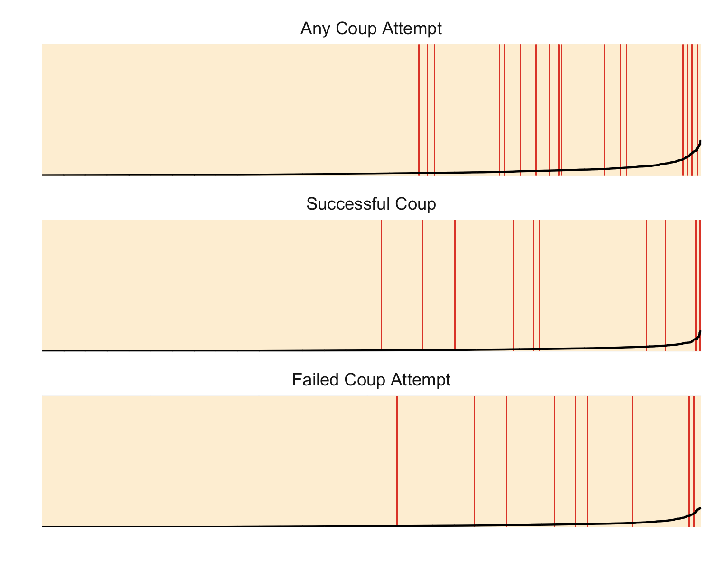

## How are coups measured?

We use the Powell and Thyne lists of coups. For more details and the original coups data see https://www.jonathanmpowell.com/coup-detat-dataset.html.

## How are the forecasts generated?

The forecasts are created using random forest models that use data from 1960 to 2018 to identify patterns predicting past coups and then 2019 data is used to project 2020 risk estimates. 

For more details, the data and code used to generate the forecasts are on GitHub at https://github.com/andybega/forecaster2. 

## Data

We use several data sources for potential coup predictors:

REIGN - The Rulers, Elections, and Irregular Governance dataset, https://oefresearch.org/datasets/reign

EPR - Ethnic Power Relations dataset, https://icr.ethz.ch/data/epr/

V-Dem - Varieties of Democracy data project, https://www.v-dem.net/en/

WDI - the World Bank's World Development Indicators, and specifically infant mortality, cell phones per capita, and interet users percent; https://databank.worldbank.org/source/world-development-indicators

More details are available at the project GitHub repo at https://github.com/andybega/forecaster2.

## Accuracy

Although the 2020 forecasts are created using models that use data through 2019, we also conduct test forecasts for 2010 to 2019. Since we already know what the record of coups was for this period, we can calculate fit measures. The table below shows the AUC-ROC and AUC-PR for the test forecasts. 

For the AUC-ROC measure, the basic skill threshold to beat is 0.5. Any model below this value is worse, on average, than a random forecast. For the AUC-PR measure, the skill threshold is equal to the positive rate in the data. For that reason we have added this to the table as well. 

<div style = "text-align: center">
<div style = "max-width: 600px; display: inline-block;">

```{r, echo=FALSE, message=FALSE}
library(readr)
library(dplyr)
library(yardstick)

fcasts <- read_rds("_data/fcasts.rds")
fcasts %>%
  # attempt2 is a bottom-up forecast of P(any coup attempt) generated by 
  # aggregating P(coup) and P(failed attempt). This guarantees that P(any coup
  # attempt) is always bigger than P(coup) or P(failed attempt), which is not
  # always the case for the model-based "attempt" estimated of P(any coup 
  # attempt)
  filter(outcome!="attempt") %>%
  group_by(outcome) %>%
  summarize(Cases = sum(observed=="1", na.rm = TRUE),
            `Pos. Rate` = round(mean(observed=="1", na.rm = TRUE), 3),
            `AUC-ROC` = round(roc_auc_vec(observed, p), 3),
            `AUC-PR`  = round(pr_auc_vec(observed, p), 3)) %>%
  rename(Outcome = outcome) %>%
  mutate(Outcome = case_when(
    Outcome=="attempt2" ~ "Any coup attempt",
    Outcome=="coup"     ~ "Successful coup",
    Outcome=="failed"   ~ "Failed coup attempt"
  )) %>%
  knitr::kable()
```

</div>
</div>

Another way to visualize performance is with separation plots. In an ideal model, the red lines, which correspond to coup attempts, etc., will be all the way on the right. 

<div style = "text-align: center">
<div style = "max-width: 600px; display: inline-block;">

</div>
</div>

## Citation

If you would like to refer to our forecasts in academic work, we would appreciate if you cite:

Andreas Beger and Michael D. Ward, 2020, "Coup forecasts for 2020", <URL>. 

## License

The forecasts are licensed under the [Creative Commons Attribution 4.0 International](https://creativecommons.org/licenses/by/4.0/) license (CC BY 4.0). The underlying code and data transformations are licensed under a [MIT license](https://github.com/andybega/forecaster2/LICENSE.md).


